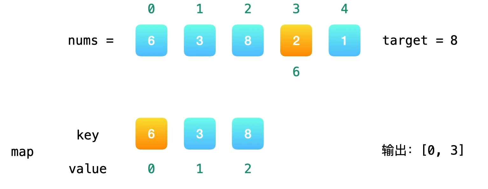
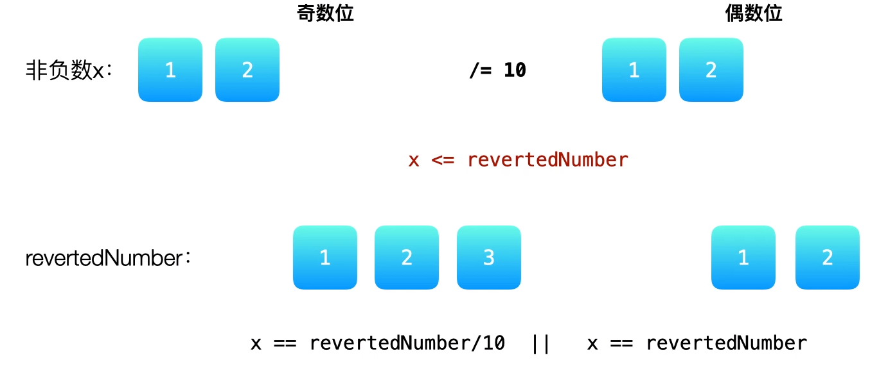

# LeetCode 算法题

[[toc]]

> 每天一道

## 简单

### 两数之和(3,3)

[题目地址](https://leetcode-cn.com/problems/two-sum/)

给定一个整数数组 nums 和一个整数目标值 target，请你在该数组中找出 和为目标值 target  的那 两个 整数，并返回它们的数组下标。

你可以假设每种输入只会对应一个答案。但是，数组中同一个元素在答案里不能重复出现。

你可以按任意顺序返回答案。

示例 1：

输入：nums = [2,7,11,15], target = 9

输出：[0,1]

解释：因为 nums[0] + nums[1] == 9 ，返回 [0, 1] 。

示例 2：

输入：nums = [3,2,4], target = 6

输出：[1,2]

示例 3：

输入：nums = [3,3], target = 6

输出：[0,1]

+ 解题思路:

+ 方法一:
  + 枚举在数组中所有的不同的两个下标的组合
  + 逐个检查它们所对应的数的和是否等于target
+ 复杂度分析:
  + 时间复杂度:O(n^2),这里n为数组的长度
  + 空间复杂度:O(1),只用到常数个临时变量

```java
class Solution {
    int arr[]=new int[2];
    public int[] twoSum(int[] nums, int target) {
        for(int i=0;i<nums.length;i++){
            for(int j=0;j<nums.length;j++){
            if((nums[i]+nums[j]==target)&&i!=j&&i>j){  
                arr[0]=j;
                arr[1]=i;    
            }
        }
    }
        return arr;    
}
}
```

+ 方法二:查找表法
  + 在遍历的同时，记录一些信息，一省去一层循环，这是“以空间换时间”的想法
  + 需要记录已经遍历过的数值和它所对应的下标，可以借助查找表实现
  + 查找表与两个常用的实现:
    + <font color=##dd0000 >哈希表</font>
    + 平衡二叉搜索树
+ 复杂度分析：
  + 时间复杂度:O(n),这里n为数组的长度
  + 空间复杂度:O(n),哈希表里最多需要存n-1个键值对



::: tip

遍历nums,第一个元素6，不在哈希表中，key为6，value为0，存入哈希表；遍历元素3，与之对应的元素应该是target-3=5,5不在哈希表中，key为3，value为1，存入哈希表中;遍历到元素8，与之对应的元素应该是target-8=0,0不在哈希表中，key为8，value为2，存入哈希表中；遍历到元素2，与之对应的元素应该是target-2=6,6在哈希表中；因此6和2就是我们要找的两个元素，对应的下标分别是0,3,将数组[0,3]返回即可，算法到此结束。

:::

```java
class Solution {
    public int[] twoSum(int[] nums, int target) {
 		int len=nums.length;
        Map<Integer,Integer> hashMap=new HashMap<>(len-1);
        hashMap.put(nums[0],0);
        for(int i=1;i<len;i++){
            int another=target-nums[i];
            if(hashMap.containsKey(another)){
                return new int[]{i,hashMap.get(target-nums[i])};
            }
            hashMap.put(nums[i],i);
        }
        throw new IllegalArgumentException("No two sum solution");
    }
}
```

> 使用 Map 的containsKey() 方法来检测another是否存在, 如果key存在,则返回i以及与之对应的数的下标hashMap.get(target-nums[i]，如果another不存在则将nums[i]，与之对应的下标i存入哈希表中。

 ### 回文数(3,4)

[题目地址](https://leetcode-cn.com/problems/palindrome-number/)

给你一个整数 x ，如果 x 是一个回文整数，返回 true ；否则，返回 false 。

回文数是指正序（从左向右）和倒序（从右向左）读都是一样的整数。

例如，121 是回文，而 123 不是。

**示例 1：**

输入：x = 121

输出：true

**示例 2：**

输入：x = -121

输出：false

解释：从左向右读, 为 -121 。 从右向左读, 为 121- 。因此它不是一个回文数

+ 方法一:进阶-反转一半数字
  + 时间复杂度:0(\log_10n)
  + 空间复杂度:0(1)



::: tip

奇数位关于中间数对称，偶数位关于最中间两个数之间对称，x取余10的操作，结果1放在整形变量revertedNumber中，x除以10，舍去最后一位，第一轮迭代；x取余10的操作，整形变量由1变为12，x除以10，第二轮迭代；x越来越小，整形变量越来越大;对于偶数位，迭代终止的条件为x=revertedNumber,对于偶数位迭代终止的条件为x<revertedNumber;奇数位还需一轮迭代，x取余10的操作，整形变量由12变为123，x除以10;对于偶数位，判断数字x和反转后的数字是否相同；对于奇数位，将反转后的数字除以10看是否与x相同

:::

```java
class Solution {
    public boolean isPalindrome(int x) {
        if (x == 0) return true;
        if (x < 0 || x % 10 == 0 && x!=0) return false;
        int reversedNumber = 0;
        while (x > reversedNumber) {
            reversedNumber = reversedNumber * 10 + x % 10;
            x /= 10;
        }
        return x == reversedNumber || x == reversedNumber / 10;
    }
}
```

+ 其他解法

<CodeSwitcher :languages="{java:'Java',python:'Python'}">

<template v-slot:java>


```java
class Solution {
    public boolean isPalindrome(int x) {
        StringBuilder sb = new StringBuilder(Integer.toString(x));
        if (sb.toString().equals(sb.reverse().toString())) return true;//reverse()反转字符串
        else return false;
    }
}
```

</template>

<template v-slot:python>


```python
class Solution:
    def isPalindrome(self,x:int)->bool:
        s=str(x)
        l=len(s)
        h=l/2
    	return s[:h]==s[-1:-h-1:-1]  #前一半字符串和后一半字符串是否相等
```

</template>
</CodeSwitcher>

