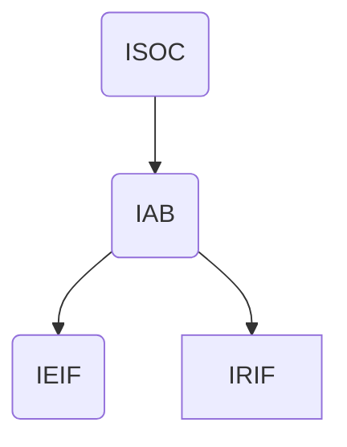

# 计算机网络-概述

[学习视频地址](https://www.bilibili.com/video/BV1c4411d7jb?p=1&vd_source=6aafd031757cd8c1dbbb98344fb3d363)

[[toc]]

## 计算机网络在信息时代的作用

+ 计算机网络已经由一种**通信基础设施**发展成为一种重要的**信息服务基础设施**。
+ 计算机网络已经像水、电、煤气这些基础设施一样，成为我们生活中不可或缺的一部分。

## 互联网概述

### 网络的网络

计算机网络有若干的**结点**(node)和连接这些结点的**链路**(link)组成。如下图所示，就是一个典型的具有四个节点，三条链路组成的网络。

通常情况下，我们可以使用一片云来表示一段网路，这样的好处是不需要关注网络内部的细节。

网络和网络之间还可以通过路由器相互连接起来，构造成一个更大的计算机网络。这样的网络成为**互连网**(internet)。因此互连网可以称为 **「网络的网络」**

**因特网**(Internet)是世界上最大的互连网络。

网络将许多计算机连接在一起，而互连网则将许多网络通过路由器连接在一起。

与网络相连的计算机通常成为主机。

> #### Internet 和 internet 的区别是什么？
>
> internet小写代表互联网，Internet大写代表因特网。
>
> 以小写字母i开始的internet（互联网或互连网）是一个通用名词，它泛指多个计算机网络互连而组成的网络，在这些网络之间的通信协议（即通信规则）可以是任意的。
>
> 以大写字母I开始的Internet（因特网）则是一个专用名词，它指当前世界上最大的、开放的、由众多网络相互连接而成的特定计算机网络，它采用TCP/IP协议族作为通信的规则，其前身是美国的ARPANET。
>
> 因特网：是通过产业、教育、政府和科研部门中的自治网络将用户连接起来的世界范围的网络。因特网采用网际协议（IP）进行网络互连和路由选择，采用传输控制协议（TCP）实现端对端控制。因特网的主要业务包括电子邮件、文件传送协议（FTP）、远程登录、万维网和电子公告板。
>
> 互联网：是两个或多个子网络构成的一种网络。这种网络可包括网桥、路由器、网关或它们的组合。
>
> 互联网、因特网的关系是：互联网 包含 因特网 。
>
> 凡是能彼此通信的设备组成的网络就叫互联网。所以，即使仅有两台机器，不论用何种技术使其彼此通信，也叫互联网。国际标准的互联网写法是internet，字母i一定要小写！跨国性的超大互联网不仅有因特网，还有惠多网。 
>
> 因特网是互联网的一种。因特网可不是仅有两台机器组成的互联网，它是由上千万台设备组成的互联网。因特网使用TCP/IP协议让不同的设备可以彼此通信。但使用TCP/IP协议的网络并不一定是因特网，一个局域网也可以使用TCP/IP协议。判断自己是否接入的是因特网，首先是看自己电脑是否安装了 TCP/IP协议，其次看是否拥有一个公网地址(所谓公网地址，就是所有私网地址以外的地址)。国际标准的因特网写法是Internet，字母I一定要大写！ 
>
> 因特网是基于TCP/IP协议实现的，TCP/IP协议由很多协议组成，不同类型的协议又被放在不同的层，其中，位于应用层的协议就有很多，比如FTP、SMTP、HTTP。只要应用层使用的是HTTP协议，就称为万维网(World Wide Web)。

### 互连网基础结构发展的三个阶段

互联网主要经历了如下三个阶段

1. 从单个网络ARPANET向互联网发展
   1. 1969年，第一个分组交换网 ARPANET
   2. 1983年，TCP/IP 协议成为 ARPANET 的标准协议
2. 逐步建成三级结构因特网
   1. 1985年，建立 NSFNET (主干网、地区网和校园网)
   2. 1991年，主干网交由私人公司
3. 形成多层次 ISP 结构
   1. 1993年，由各个因特网 ISP 运营
   2. 1994年，万维网 WWW 技术促使互联网飞速发展
   3. 1995年，NSFNET停止，因特网彻底商业化。

**ISP(Internet Service Provider)** 通常可以从因特网中申请到一定的IP地址。

如下所示，是三层ISP的结构。不过由于现在的网络规模过大，三层已经很难描述如今的网络结构了。另外，如果一个用户接入因特网，那么这个人也可以成为一个 ISP。所以这个图仅仅是一个示意图。

### 因特网的标准化工作

因特网的标准化对如今的互联网非常重要。因特网在指定标准上的一个很大的特点是**面向公众**。并且所有的RFC(Request For Comments)计数文档都可以在因特网上免费下载到。

因特网的标准化成立了一个机构叫做**互联网协会ISOC**(Internet Society)。

ISOC 下有一个技术组织叫做**互联网体系结构委员会IBA**(Internet Architecture Board)，负责管理互联网有关的协议的开发。

IBA下又有两个工程部。

1. **互联网工程部IETF**(Internet Engineering Task Force)负责研究中短期问题，主要针对协议的开发和标准化。
2. **互联网研究部IRTF**(Internet Research Task Force)主要研究一些需要长期考虑的问题，包括互联网的一些协议、应用、体系结构等。

层次如下

制定因特网的正式标准需要经过下述3个阶段

1. 因特网草案 (不能算是RFC文档)
2. 建议标准 (开始成为RFC文档)
3. 因特网标准 (达到正式标准后，分配编号SID xx)

## 互联网的组成

互联网主要包括下述两个部分

1. 边缘部分
   1. 有所有连接在互联网上的主机组成
   2. 是用户**直接使用**的
   3. 用来通信和资源共享
2. 核心部分
   1. 由大量网络和连接这些网络的路由器组成
   2. 主要为**边缘部分提供服务**的

### 互联网的边缘部分

处在互联网边缘的部分是连接在互联网上所有的主机。成为端系统(end system)。

通常来说，两台电脑通信可以简单的理解为『主机A上的某个进程和主机B上的某个进程进行通信』。将这种说法称为 **「计算机间的通信」**。

通常通信主要有两种

1. 客户-服务端(C/S)
2. 对等(P2P)

#### 客户服务器方式

通常一个程序可能涉及到两个地方的通信一个是 **客户**(client) 和 **服务器**(server)

通常来说，**客户是服务的请求方，服务器是服务的提供方**。

通常来说，他们分别有如下的特点。

客户程序

1. 被用户调用后运行，同时向服务器请求服务。因此，客户程序必须知道服务程序的地址
2. 不需要特殊的硬件和操作系统

服务程序

1. 专门用来提供某种服务的程序，可以**同时处理**多个请求
2. 启动后不断的运行这，等待请求。因此服务程序不需要知道客户程序的地址。
3. 一般需要强大的硬件和高级的操作系统支持。

但是，他们一旦建立连接后通信就可以是双向的了。

------

#### 对等连接的方式

**对等连接**(peer-to-peer) 也被称为 P2P。

对等连接的意思非常容易明白。一天电脑既可以成为客户端，也可以成为服务端，当一个资源共享量非常大的时候，那么这个时候这种连接方式得到的速度提升是非常大的。

### 互联网的核心部分

网络核心是互联网中最复杂的部分。

在网络核心中起特殊作用的是**路由器**(router)，路由器实现了**分组交换**(packet switching)的关键功能。

其中三种交换方式分别由如下三种:

1. 电路交换
2. 分组交换
3. 报文交换

#### 电路交换

电路交换起初是用在电话上的，这个电路通常是两两连接的。因此，当有 n 个电话的时候，这个时候就有 `n(n−1)2 /2` 对电线。这是十分庞大的。

在如今通常采用交换机将这些电话互相连接起来。

从通信的角度来看，**交换** (switching)就是按照某种方式动态的分配传输线路的资源。

电路交换通常需要以下的三个步骤。

1. 建立连接 (分配通信资源)
2. 通话 (一直占用资源)
3. 释放连接 (归还通信资源)

#### 分组交换

一段信息通常会被分成多条信息。每条都是一段报文。

如图中所示一条报文包含首部和数据。

如上图。由于到达目的地的**路线可能不一致**，因此首部中一般还会包含有顺序等。

那么因此，分组交换通常会需要以下三个部分。

1. 发送方: 构造分组、发送分组
2. 路由器: 缓存分组、转发分组
3. 接收方: 接受分组、还原报文

报文交换与分组交换类似，不过由于其报文的大小未做限制，因此对路由器等设备的空间要求较高，所以使用的较少，不做更多的介绍。

#### 对比

## 计算机在我国网络中的发展

我国规模最大的网络

1. CHINANET 中国电信
2. UNINET 中国联通
3. CMNET 中国移动
4. CERNET 中国教育
5. CSTNET 中国科学技术

## 计算机网路的类别

1. 按照网络的范围
   1. 广域网 WAN
   2. 城域网 MAN
   3. 局域网 LAN
   4. 个人网 PAN
2. 网络使用者
   1. 公用网，又称为公众网
   2. 专用网，不对外公开的网络。
3. 传输介质
   1. 有限
   2. 无线
4. 拓扑结构
   1. 总线
   2. 环形
   3. 网状
   4. 星型
5. 传输技术
   1. 广播网
   2. 点对点
6. 交换方式
   1. 电路交换
   2. 报文交换
   3. 分组交换

## 计算机网络的性能

### 计算机网络的性能指标 *

1. 速率
   - 是最重要的性能指标
   - 存储的单位是二进制千，传输速率是十进制千，需要注意。
2. 带宽
   - 模拟信号中的意义
     - **信号**所包含的各种不同频率成分所占据的**频率范围**
     - 单位 Hz
   - 在计算机网络中的意义
     - 用来表示网络的通信线路所能传输数据的能力，通常为「最高数据率」。
     - 单位 `b/s`
3. 吞吐量
   - 在单位时间内通过某个网络(或信道、接口)的**数据量**
   - 是用于对现实世界中的网络的一种测量，一边知道到底有多少数据量能够通过网络
   - 吞吐量受到**网络的带宽或额定速率**的限制
4. 时延
   - 主要由三部分时延
     - 发送时延 : 是由源主机发送到传输线路的时间
     - 传播时延 : 信号在传输线线路上传输的时间
     - 处理时延 : 信号在路由器上处理的时间

计算方式如下

| 时延类别 | 计算方式                                              |
| -------- | ----------------------------------------------------- |
| 发送时延 | 分组长度发送速率分组长度(b)/发送速率(b/s)             |
| 传播时延 | 信道长度电磁波传播速率信道长度(m)/电磁波传播速率(m/s) |
| 处理时延 | 不方便计算                                            |

> 注意：
>
> 1. 发送速率同时受到网卡速率，信道带宽，接口速率影响
>
>    网卡的发送速率理论上限是这三者中的最小值。
>
> 2. 电磁波的传播速率通常受到介质的影响
>
>    1. 自由空间 3×10^8^m/s
>    2. 铜线 2.3×10^8^m/s
>    3. 光纤 2.0×10^8^m/s
>
> 3. 在时延中，占据主导地位的时延通常随情况而改变。

5. 时延带宽积

*时延带宽积传播时延带宽时延带宽积=传播时延×带宽*

- 在发送端连续发送数据的情况下，在第一个比特到达终点的时候，发送端到终点中的 `bit` 数就是时延带宽积
- 链路的时延带宽积又称 **以比特为单位的链路长度**
- 起点到终点的链路中所能容纳的最大数据量。

6. 往返时间

往返时间 **RTT**(**R**ound-**T**rip **T**ime) 是指从出发点发出分组信号，直到出发点收到终点的确认收到为止。

7. 利用率

1. 信道利用率 : 用来表示信道有百分之多少的时间是被利用的
2. 网络利用率 : 全网络的信道利用绿的加权平均值

根据排队论，信道的利用率增大时，信道引起的时延也会增大。因此信道的**利用率并非越大越好**

用 D0 表示网络空闲时的时延，D 表示当前网络的时延，U 表示利用率。 D=D~0~/1−U 有如下所示的关系	

8. 丢包率
   1. 丢包率是指，丢失分组的数量与总分组数量的比率
   2. 丢包主要有以下两种情况
      1. 传输过程中出现误码，被结点丢弃
      2. 网络拥塞时被丢弃

### 计算机网络的非性能指标 -

1. 费用
2. 质量
3. 标准化
4. 可靠性
5. 可扩展性和可升级性
6. 易于管理和维护

## 计算机体系结构 

### 常见的计算机网络体系结构

- 1977年 ISO 提出 **OSI/RM** (Open System Internection Reference Model)，简称为 OSI
- TCP/IP 由于使用广泛，成为了实际上的网络标准

OSI 没有成为实际上的标准主要有以下几点原因。

1. 缺乏实际经验，没有商业的驱动力。
2. OSI 协议复杂，运行效率低
3. OSI 制定的周期太长
4. OIS 层次划分不合理，有很多功能重复的地方。

通常用于教学时，网络结构层需要重新划分为**数据链路层**和**物理层**

### 计算机网络分层的必要性

计算机网络时**非常复杂**的系统，分层可以将庞大的问题细化。

1. 物理层
   - 实现比特 0\1 的传输
2. 网络接口层
   - 标识网络中各个主机
   - 从信号中区分出地址信息
   - 实现 **一个网络** 之间的 **相互通信**
3. 网络层
   - 标识各个网络以及各个网络中的各主机
   - 路由器如何转发分组，路由器如何进行路由选择
4. 运输层
   - 解决进程之间基于网络的通信功能
   - 传输出现错误的时候，如何处理
5. 应用层
   - 通过应用进程的交互来完成特定的网络应用

### 计算机网络体系结构分层思想举例

具体过程请看

[视频地址](https://www.bilibili.com/video/BV1c4411d7jb?p=9&share_source=copy_web){: .btn }

传输的过程自顶向下，逐层添加数据。自下向顶逐层解包。

### 计算机网络中的相关术语

1. 实体
   - 实体是指任何可发送或接受信息的 **硬件或软件进程**
   - 对等实体，是指收发双方中 **相同层次中的实体**
2. 协议
   - 协议是指两个对等实体进行逻辑通信的规则的集合
   - 逻辑通信实际中并不存在，只是假设的一种通信
   - 协议的三要素
     - 语法 定义交换信息的格式
     - 语义 定义双方需要完成的的操作
     - 同步 定义收发双方的时序关系
3. 服务
   - 在协议的控制下，两个对等实体间的通信使得本层能够向上一层提供服务
   - 如果要实现本层的协议，必须要下一层所提供的服务
   - 协议是水平的，而服务是垂直的
   - 实体看得见下层提供的服务，但并不知道实现该服务的具体协议。
4. Other
   1. 服务访问点 在同一系统中**相邻两层的实体交换信息的逻辑接口**，用于区分不同服务的类型。
   2. 服务原语 上层使用下层所提供的服务必须通过与下层**交换一些命令** ，这些命令成为服务原语。
   3. 协议数据单元PDU **对等层次之间传送的数据包** ，成为该层的协议数据单元
   4. 服务数据单元SDU **同意系统内，层与层之间交换的数据包** 成为服务数据单元。
   5. 多个 SDU 可以合并为一个 PDU ；一个 SDU 也可以划分为几个 PDU

