# 搭建Hadoop集群

[[toc]]

::: tip

搭建集群作为一件事，应该一气呵成，希望你腾出一两个小时的时间来完成搭建，提前祝你搭建成功!

:::

+ [Hadoop官网](https://hadoop.apache.org/)
+ [Hadoop下载地址](https://archive.apache.org/dist/hadoop/common/)

## 规划

+ NameNode:1台
  + NameNode主机名:master(主节点)

+ DateNode:3台
  + DataNode主机名:slave1(从节点1)
  + DataNode主机名:slave2(从节点2)
  + DataNode主机名:slave3(从节点3)

## 配置网络

>  为了方便远程工具登录，我们需要指定IP地址

1. 打开命令行cmd，输入**ipconfig**查看VMnet8的ip网段，每个人的可能都不一样，例如我的就是192.168.197.1

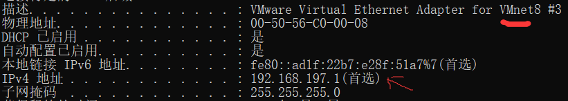

2. 打开VMware，点击编辑，选择虚拟网络编辑器，查看VMnet8的网段和cmd命令行的网段是否一致，若一致，则可以继续。不一致，需要点击更改设置，还原默认设置。

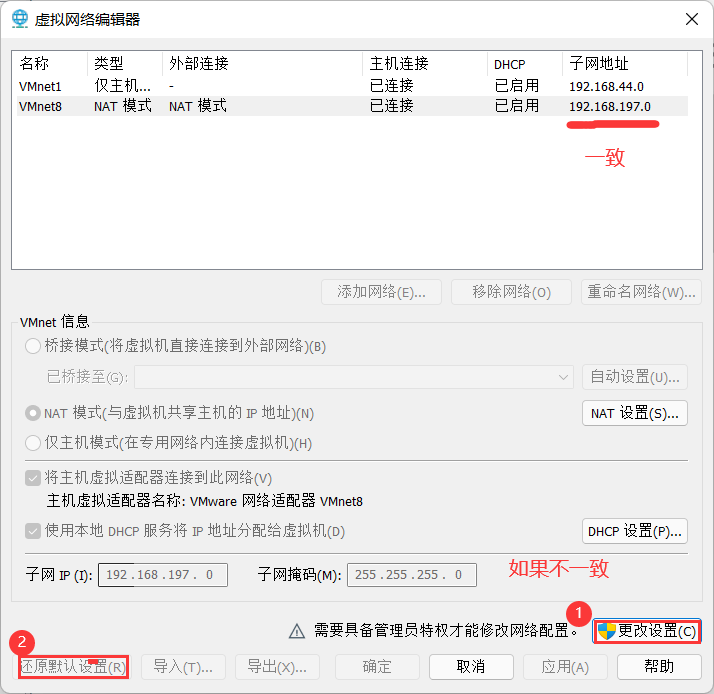

3. 安装虚拟机

安装虚拟机可以看老师发的文档

4. 安装成功后，开启虚拟机，使用root用户登陆，点击未列出按钮，输入用户名root和密码登陆。
5. 右键打开终端，输入

```shell
vim /etc/sysconfig/network-scripts/ifcfg-ens33
```

6. 输入i进入编辑模式。[vim用法](https://xustudyxu.github.io/VuepressBlog/studynotes/Linux/4/#_4-2-3-%E5%91%BD%E4%BB%A4%E8%A1%8C%E6%A8%A1%E5%BC%8F).,这里我们有五处需要修改:

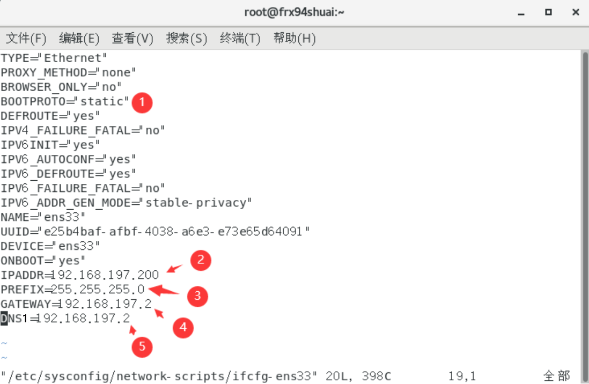

1. IP配置方法：将双引号里的dhcp改为static
2. 指定IP地址为192.168.197.200
3. IP地址子网掩码：这个设置为255.255.255.0
4. 网关：和指定IP地址前三位一样，最后一位为2
5. 域名解析器：和网关设置为一样就行

> ip地址我们可以自己设置，但是设置的ip地址必须要在虚拟机地址的范围内，查看虚拟机ip地址的范围如下图所示：
>
> 

修改完成后，保存退出，输入指令

```shell
systemctl restart network
```

重启网络，并测试网络是否能上网，可以ping一下百度，出现下图则可以上网。

```shell
[root@frx94shuai ~]# ping www.baidu.com
PING www.a.shifen.com (110.242.68.4) 56(84) bytes of data.
64 bytes from 110.242.68.4 (110.242.68.4): icmp_seq=1 ttl=128 time=25.2 ms
64 bytes from 110.242.68.4 (110.242.68.4): icmp_seq=2 ttl=128 time=28.4 ms
64 bytes from 110.242.68.4 (110.242.68.4): icmp_seq=3 ttl=128 time=26.3 ms
^C
--- www.a.shifen.com ping statistics ---
3 packets transmitted, 3 received, 0% packet loss, time 2008ms
rtt min/avg/max/mdev = 25.284/26.713/28.489/1.331 ms

```

> 现在主节点已经可以上网，并且能够远程登录连接了

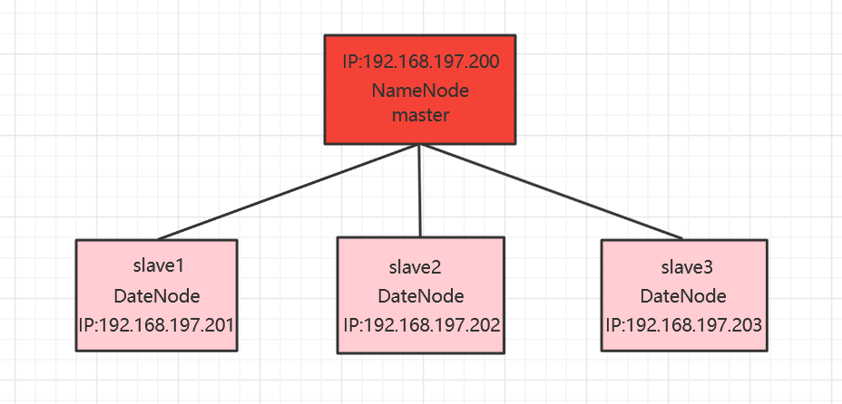

## 修改主机名

1. 使用远程登录工具Xshell或者MobaXterm到linux系统,输入命令,修改主机名为master(或者在安装的时候指定主机名为master)

```shell
vim /etc/hostname
```

这个重启生效,使用重启命令

```shell
reboot
```

## 安装和配置Java

### 卸载原有的JDK

首先，通过命令“**java -version**”查看是否已安装Java，如图1-14所示，由于CentOS 7自带的Java是Oracle OpenJDK，而更建议使用Oracle JDK，因此将Oracle OpenJDK卸载。

```shell
[root@master ~]# java -version
openjdk version "1.8.0_262"
OpenJDK Runtime Environment (build 1.8.0_262-b10)
OpenJDK 64-Bit Server VM (build 25.262-b10, mixed mode)
```

其次，使用“**rpm-qa|grep jdk**”命令查询jdk软件

```shell
[root@master ~]# rpm -qa|grep jdk
java-1.7.0-openjdk-headless-1.7.0.261-2.6.22.2.el7_8.x86_64
copy-jdk-configs-3.3-10.el7_5.noarch
java-1.8.0-openjdk-headless-1.8.0.262.b10-1.el7.x86_64
java-1.8.0-openjdk-1.8.0.262.b10-1.el7.x86_64
java-1.7.0-openjdk-1.7.0.261-2.6.22.2.el7_8.x86_64
```

最后，切换到root用户下，分别使用命令“**yum -y remove java-1.8.0***”和“**yum -y remove java-1.7.0***”卸载openjdk 1.8和openjdk 1.7

```shell
[root@master ~]# yum -y remove java-1.8.0*
已加载插件：fastestmirror, langpacks
正在解决依赖关系
--> 正在检查事务
---> 软件包 java-1.8.0-openjdk-headless.x86_64.1.1.8.0.262.b10-1.el7 将被 删除
--> 解决依赖关系完成

依赖关系解决

=============================================================================================
 Package                         架构       版本                         源             大小
=============================================================================================
正在删除:
 java-1.8.0-openjdk-headless     x86_64     1:1.8.0.262.b10-1.el7        @anaconda     109 M

事务概要
=============================================================================================
移除  1 软件包

安装大小：109 M
Downloading packages:
Running transaction check
Running transaction test
Transaction test succeeded
Running transaction
  正在删除    : 1:java-1.8.0-openjdk-headless-1.8.0.262.b10-1.el7.x86_64                 1/1 
  验证中      : 1:java-1.8.0-openjdk-headless-1.8.0.262.b10-1.el7.x86_64                 1/1 

删除:
  java-1.8.0-openjdk-headless.x86_64 1:1.8.0.262.b10-1.el7                                   

完毕！
[root@master ~]# yum -y remove java-1.7.0*
已加载插件：fastestmirror, langpacks
正在解决依赖关系
--> 正在检查事务
---> 软件包 java-1.7.0-openjdk.x86_64.1.1.7.0.261-2.6.22.2.el7_8 将被 删除
--> 正在处理依赖关系 java >= 1.5，它被软件包 jline-1.0-8.el7.noarch 需要
---> 软件包 java-1.7.0-openjdk-headless.x86_64.1.1.7.0.261-2.6.22.2.el7_8 将被 删除
--> 正在检查事务
---> 软件包 jline.noarch.0.1.0-8.el7 将被 删除
--> 正在处理依赖关系 jline，它被软件包 rhino-1.7R5-1.el7.noarch 需要
--> 正在检查事务
---> 软件包 rhino.noarch.0.1.7R5-1.el7 将被 删除
--> 解决依赖关系完成

依赖关系解决

=============================================================================================
 Package                        架构      版本                            源            大小
=============================================================================================
正在删除:
 java-1.7.0-openjdk             x86_64    1:1.7.0.261-2.6.22.2.el7_8      @anaconda    679 k
 java-1.7.0-openjdk-headless    x86_64    1:1.7.0.261-2.6.22.2.el7_8      @anaconda     95 M
为依赖而移除:
 jline                          noarch    1.0-8.el7                       @anaconda     72 k
 rhino                          noarch    1.7R5-1.el7                     @anaconda    1.1 M

事务概要
=============================================================================================
移除  2 软件包 (+2 依赖软件包)

安装大小：97 M
Downloading packages:
Running transaction check
Running transaction test
Transaction test succeeded
Running transaction
  正在删除    : rhino-1.7R5-1.el7.noarch                                                 1/4 
  正在删除    : jline-1.0-8.el7.noarch                                                   2/4 
  正在删除    : 1:java-1.7.0-openjdk-1.7.0.261-2.6.22.2.el7_8.x86_64                     3/4 
  正在删除    : 1:java-1.7.0-openjdk-headless-1.7.0.261-2.6.22.2.el7_8.x86_64            4/4 
  验证中      : 1:java-1.7.0-openjdk-headless-1.7.0.261-2.6.22.2.el7_8.x86_64            1/4 
  验证中      : 1:java-1.7.0-openjdk-1.7.0.261-2.6.22.2.el7_8.x86_64                     2/4 
  验证中      : rhino-1.7R5-1.el7.noarch                                                 3/4 
  验证中      : jline-1.0-8.el7.noarch                                                   4/4 

删除:
  java-1.7.0-openjdk.x86_64 1:1.7.0.261-2.6.22.2.el7_8                                       
  java-1.7.0-openjdk-headless.x86_64 1:1.7.0.261-2.6.22.2.el7_8                              

作为依赖被删除:
  jline.noarch 0:1.0-8.el7                     rhino.noarch 0:1.7R5-1.el7                    

完毕！
```

### 安装新的JDK

需要根据机器所安装的操作系统和位数选择相应JDK安装包下载，可以使用命令“getconf LONG_BIT”来查询Linux操作系统是32还是64位；也可以使用命令“file /bin/ls”来显示Linux版本号

```shell
[root@master ~]# getconf LONG_BIT
64
```

+ 我是用的是jdk-8u301-linux-x64.tar.gz,这个版本

  >  这个jdk压缩包，可以问我要

+ 使用XFTP将压缩包传送到Linux系统中,我是下载到/opt/java1.8/这个文件夹中

```shell
mkdir /opt/java1.8
```

+ 右键传输一下就OK了

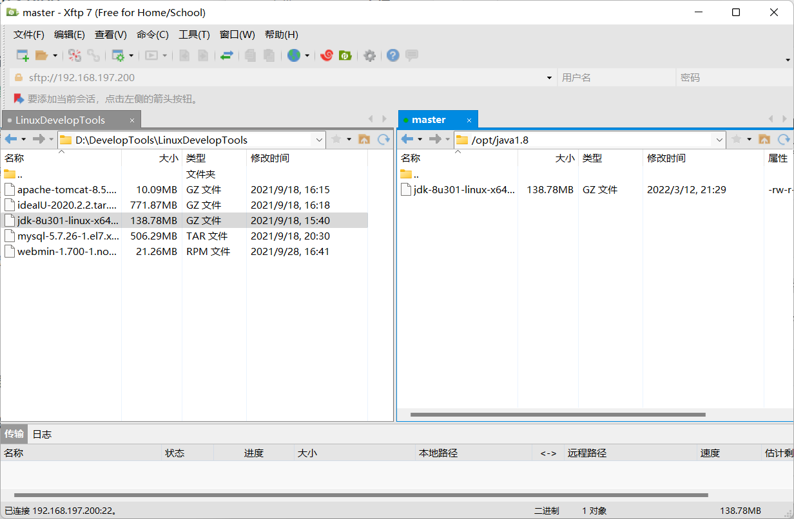

```shell
mkdir /usr/local/java
cd /opt/java1.8/
tar -zxvf jdk-8u301-linux-x64.tar.gz -C /usr/local/java
```

通过修改/etc/profile文件完成环境变量JAVA_HOME、PATH和CLASSPATH的设置，输入G跳转到最后，在配置文件/etc/profile的最后添加如下内容

```shell
# set java environment
export JAVA_HOME=/usr/local/java/jdk1.8.0_301
export PATH=$JAVA_HOME/bin:$PATH
export CLASSPATH=.:$JAVA_HOME/lib/dt.jar:$JAVA_HOME/lib/tools.jar
```

```shell
vim /etc/profile
```

使用命令“source /etc/profile”重新加载配置文件或者重启机器，使配置生效，Java环境变量配置成功后的系统变量“PATH”值

```shell
[root@master java]# echo $PATH
/usr/local/java/jdk1.8.0_301/bin:/usr/local/java/1.8.0_301/bin:/opt/hadoop/hadoop-2.10.1/bin:/usr/local/java/jdk1.8.0_261/bin:/opt/hadoop/hadoop-2.10.1/bin:/opt/java1.8/jdk1.8.0_301/bin:/opt/hadoop/bin:/opt/java1.8/jdk1.8.0_301/bin:/opt/hadoop/bin:/opt/java1.8/jdk1.8.0_301/bin:/opt/java1.8/jdk1.8.0_301/bin:/usr/local/sbin:/usr/local/bin:/usr/sbin:/usr/bin:/root/bin
```

验证Java,再次使用命令“java -version”，查看Java是否安装配置成功及其版本

```shell
[root@master java1.8]# java -version
java version "1.8.0_301"
Java(TM) SE Runtime Environment (build 1.8.0_301-b09)
Java HotSpot(TM) 64-Bit Server VM (build 25.301-b09, mixed mode)
```

## 安装Hadoop

在上面我已经提供了Hadoop(v2.10.1)的下载地址,老师提供的也有

+ 下载完成，再次使用XFTP传送到linux系统的/opt/hadoop/中

```shell
mkdir /opt/hadoop/
```

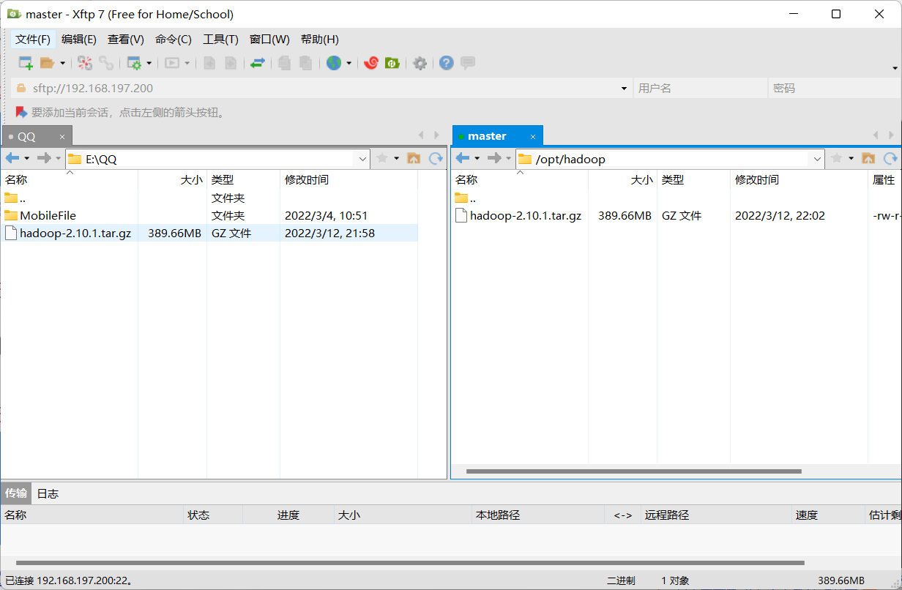

+ 传输完成

```shell
cd /opt/hadoop/
tar -zxvf hadoop-2.10.1.tar.gz 
```

+ 关闭防火墙

```shell
systemctl stop firewalld.service
systemctl disable firewalld.service
```

+ 关闭selinux

```shell
vim /etc/selinux/config
```

`修改为 SELINUX=disabled`

+ 解压之后,在/etc/profile文件的最后，配置hadoop的环境变量

```shell
vim /etc/profile
```

```shell
export HADOOP_HOME=/opt/hadoop/hadoop-2.10.1
export PATH=$HADOOP_HOME/bin:$PATH  
export PATH=$HADOOP_HOME/sbin:$PATH 
```

+ "source /etc/profile"重新加载配置文件或者重启机器，使配置生效

```shell
[root@master bin]# source /etc/profile
[root@master bin]# hadoop version
Hadoop 2.10.1
Subversion https://github.com/apache/hadoop -r 1827467c9a56f133025f28557bfc2c562d78e816
Compiled by centos on 2020-09-14T13:17Z
Compiled with protoc 2.5.0
From source with checksum 3114edef868f1f3824e7d0f68be03650
This command was run using /opt/hadoop/hadoop-2.10.1/share/hadoop/common/hadoop-common-2.10.1.jar
```

+ 创建HDFS的NN和DN工作主目录

```shell
mkdir /var/big_data
```

### Hadoop系统配置

::: tip

所有的\<property>标签都在\<configuration>与\</configuration>标签之间

:::

+ cd /opt/hadoop/hadoop-2.10.1/etc/hadoop

```shell
[root@master hadoop]# cd /opt/hadoop/hadoop-2.10.1/etc/hadoop
[root@master hadoop]# ls
capacity-scheduler.xml      httpfs-env.sh            mapred-env.sh
configuration.xsl           httpfs-log4j.properties  mapred-queues.xml.template
container-executor.cfg      httpfs-signature.secret  mapred-site.xml.template
core-site.xml               httpfs-site.xml          slaves
hadoop-env.cmd              kms-acls.xml             ssl-client.xml.example
hadoop-env.sh               kms-env.sh               ssl-server.xml.example
hadoop-metrics2.properties  kms-log4j.properties     yarn-env.cmd
hadoop-metrics.properties   kms-site.xml             yarn-env.sh
hadoop-policy.xml           log4j.properties         yarn-site.xml
hdfs-site.xml               mapred-env.cmd
```

+ 编辑hadoop-env.sh,设置JAVA_HOME

```shell
vim hadoop-env.sh
```

```shell
export JAVA_HOME=/usr/local/java/jdk1.8.0_301
```

+ 编辑yarn-env.sh,设置JAVA_HOME

```shell
vim yarn-env.sh
```

```shell
JAVA_HOME=/usr/local/java/jdk1.8.0_301
```

+ 配置HDFS主节点信息、持久化和数据文件的主目录

```shell
vim core-site.xml
```

```xml
   <property>
        <name>fs.defaultFS</name>
        <value>hdfs://master:9000</value>
    </property>
    <property>
        <name>hadoop.tmp.dir</name>
        <value>/var/big_data</value>
   </property>
```

+ 配置HDFS的核心,编辑HDFS默认的数据存放策略

```shell
vim hdfs-site.xml
```

```xml
	<property>
    	<name>dfs.replication</name>
    	<value>2</value>
	</property>
	<property>
    	<name>dfs.namenode.secondary.http-address</name>
    	<value>slave3:50090</value>
	</property>
```

+ 编辑mapred-site.xml,配置mapreduce任务调度策略

```shell
mv mapred-site.xml.template mapred-site.xml
```

```shell
vim mapred-site.xml
```

```xml
	<property>
    	<name>mapreduce.framework.name</name>
        <value>yarn</value>
    </property>
```

+ 编辑yarn-site.xml配置Yarn资源管理角色的信息

```shell
vim yarn-site.xml
```

```xml
	<property>
    	<name>yarn.nodemanager.aux-services</name>
    	<value>mapreduce_shuffle</value>
    </property>
    <property>
    	<name>yarn.resourcemanager.hostname</name>
        <value>master</value>
    </property>
```

+ 配置datanode节点信息

```shell
vim slaves
```

```xml
slave1
slave2
slave3
```

+ 提前准备主机名解析文件，为后面的克隆机器做好准备（可选，若不做，克隆后为每台机器重新添加亦可）

```shell
 vim /etc/hosts
```

```xml
192.168.197.200 master
192.168.197.201 salve1
192.168.197.202 salve2
192.168.197.203 salve3
```

## 配置从节点的网络

### 克隆三台完整的虚拟机

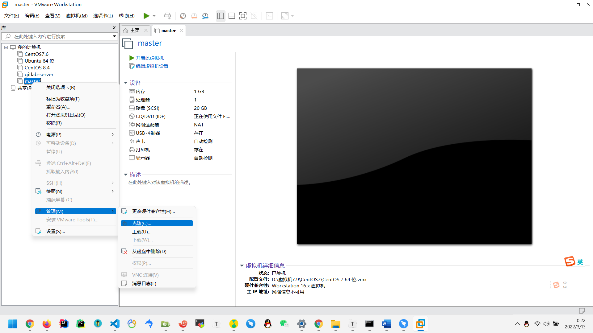

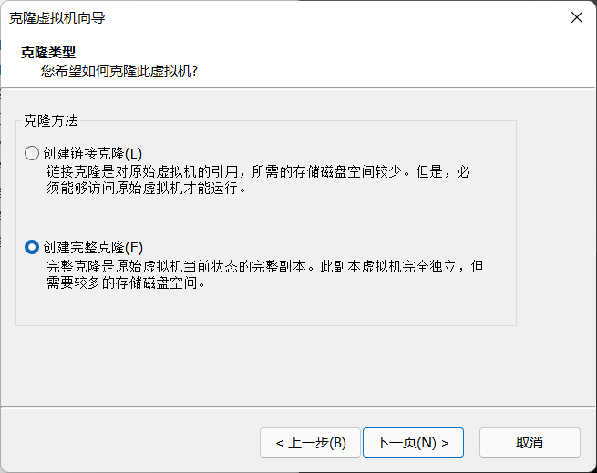

> 因为是完整克隆，我们的主机名也要重新设置，并且指定IP地址
>
> 可以看前面的笔记

+ salve1修改主机名为salve1
  + IP地址指定为192.168.197.201
+ salve1修改主机名为salve2
  - IP地址指定为192.168.197.202
+ salve1修改主机名为salve3
  - IP地址指定为192.168.197.203


### 免密登录

+ 在4台机器上执行产生自己的公钥

```shell
ssh-keygen -t rsa
```

按照默认回车就完了

+ 将每台机器的公钥拷贝给每台机器，注意下面的指令要求4台机器都执行

```shell
ssh-copy-id master
ssh-copy-id salve1
ssh-copy-id salve2
ssh-copy-id salve3
```

+ ssh master

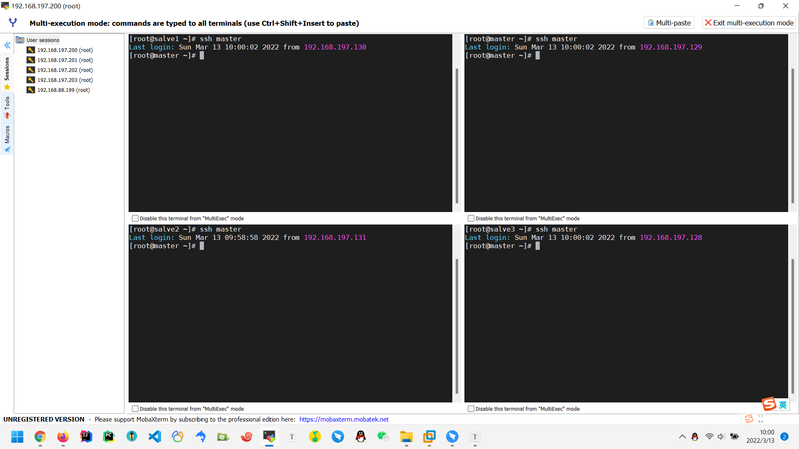

+ exit

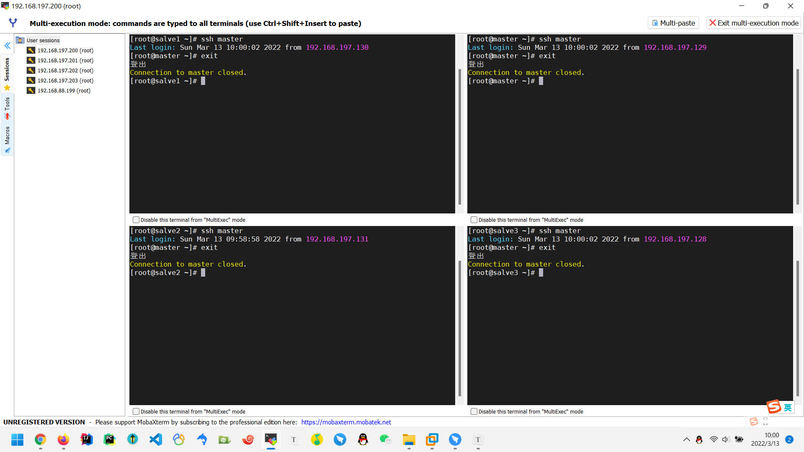

+ 格式化

```shell
hdfs namenode -format
```

+ 开启集群：

```shell
start-dfs.sh
```

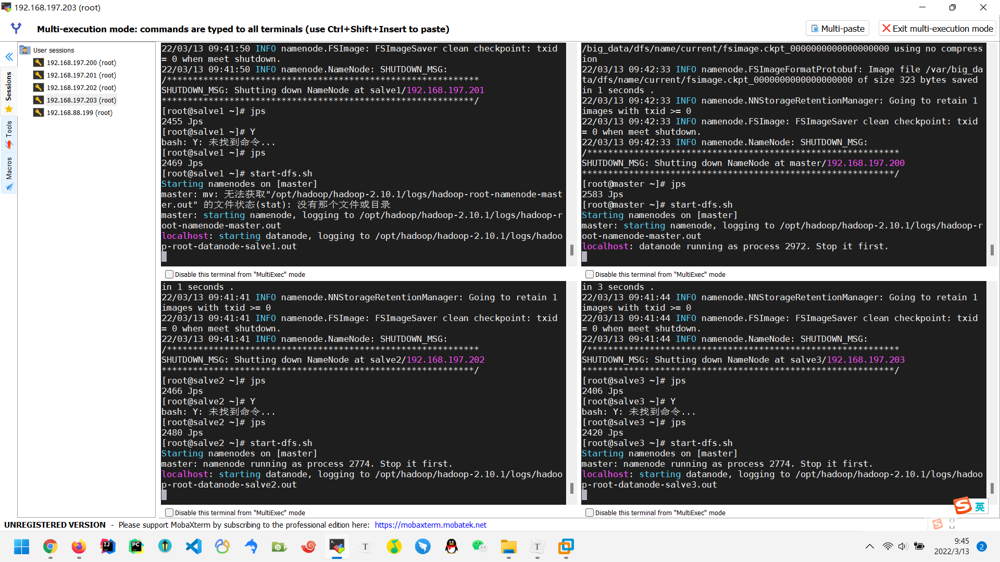

+ jps查看关于java线程状态

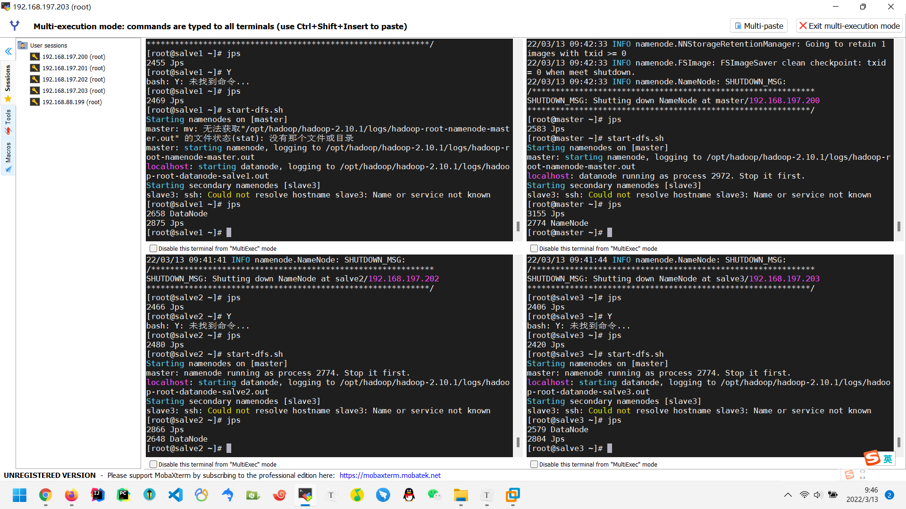

+ 访问URL


+ 文件系统


+ hdfs dfs -mkdir /t01 ,创建个文件夹试一下

```shell
[root@master ~]# hdfs dfs -mkdir /t01
```

+ 访问URL

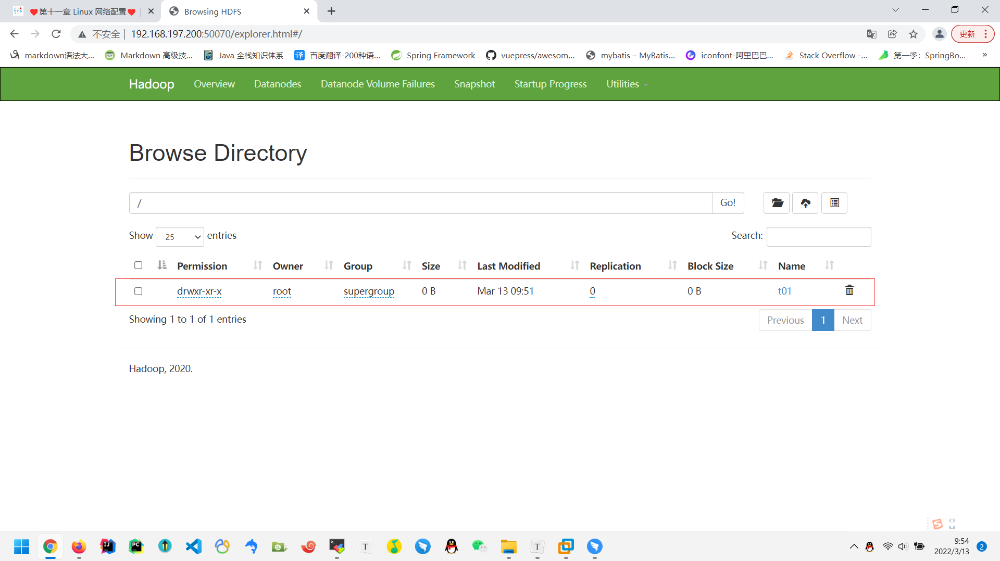

> ## enjoy