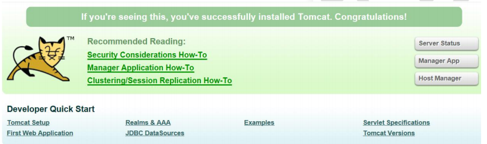
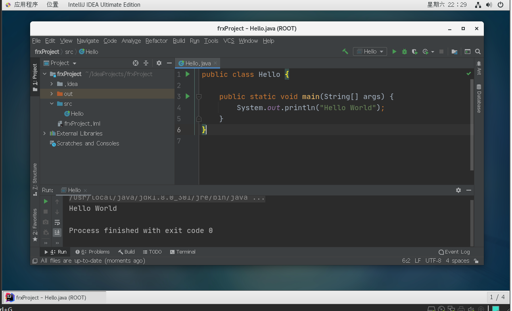

# 第十四章 Linux 搭建JavaEE环境

## 14.1 概述

如果需要在Linux下进行JavaEE的开发，我们需要安装如下软件

## 14.2 安装JDK

### 14.2.1 安装步骤

1. mkdir /opt/jdk
2. 通过xftp6上传到/opt/jdk下
3. cd /opt/jdk
4. 解压tar -zxvf jdk-8u261-linux-x64.tar.gz
5. mkdir /usr/local/java
6. mv /opt/jdk/jdk1.8.0_261  /usr/local/java
7. 配置环境变量的配置文件vim /etc/profile
8. export JAVA_HOME=/usr/local/java/jdk1.8.0_261
9. export PATH=$JAVA_HOME/bin:$PATH
10. source /etc/profile[让新的环境变量生效]

### 14.2.2 测试是否安装成功

编写一个简单的Hello.java输出"hello, world!"

## 14.3 tomcat的安装

### 14.3.1 安装步骤

1. 上传安装文件，并解压缩到/opt/tomcat
2. 进入解压目录/bin，启动tomcat  ./startup.sh
3. 开放端口8080，回顾firewall-cmd

### 14.3.2 测试是否安装成功

在windows、Linux下访问http://linuxip:8080

## 14.4 idea2020的安装

### 14.4.1 步骤

1. 下载地址: https://www.jetbrains.com/idealdownload/#section=windows
2. 解压缩到/opt/idea
3. 启动idea bin目录下/idea.sh，配置jdk
4. 编写Hello world程序并测试成功!

### 14.5 mysql5.7的安装

1. 新建文件夹/opt/mysql，并cd进去

2. 运行wget http://dev.mysql.com/get/mysql-5.7.26-1.el7.x86_64.rpm-bundle.tar，下载mysql安装包

 PS：centos7.6自带的类mysql数据库是mariadb，会跟mysql冲突，要先删除。

3. 运行tar -xvf mysql-5.7.26-1.el7.x86_64.rpm-bundle.tar 

4. 运行rpm -qa|grep mari，查询mariadb相关安装包

5. 运行rpm -e--nodeps mariadb.libs，卸载

6. 然后开始真正安装mxsql，依次运行以下几条

   rpm -iwh mysql-community-common-5.7.26-1.e17.x86_64.rpm

   rpm -ixh mysql-community-libs-5.7.26-1.e17.x86_64rpm

   rpm-iwh mysql-community-client-5.7.26-1.e17.x86_64.rpm

   rpm -ixh mysql-community-server-5.7.26-1.e17.x86_64.rpm

7. 运行sxstemctl start mvsqld.service，启动mxsal
8. 然后开始设器root用户密码Mysg!自动给root用户设置随机密码，运行 grep  "password"/var/log/mvsqld.log可看到当前密码
9. .运行mvsal -u root-p，用root用户登录，提示输入密码可用上述的，可以成功登陆进入mxsal.命令行
10. 设置root密码，对于个人开发环境，如果要设比较简单的密码（生产环境服务器要设复杂密码)，可以运行set global validate_password_policy=o;提示密码设置策略
    ( validate_password_policy 默认值1 ,)

11. set password for 'root'@'losalhost-password('frx01123');
12. 运行flush privileges;使密码设置生效

