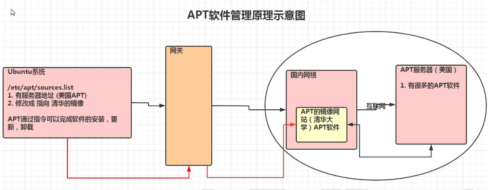
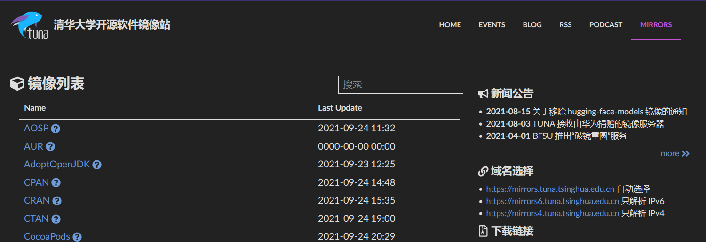
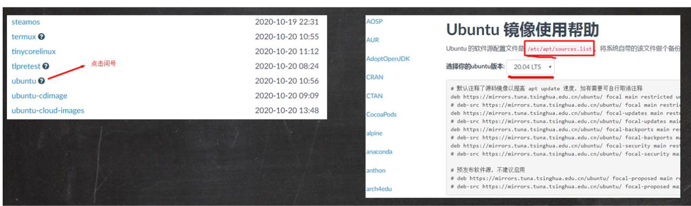
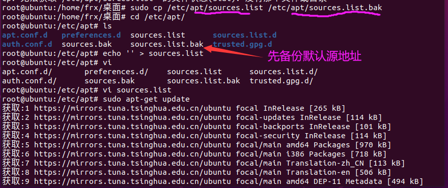
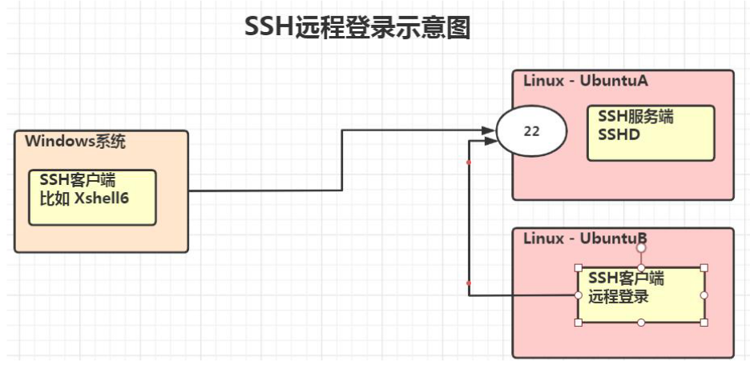

# **:heart:**第十七章 Python定制篇-APT软件管理和远程登录**:heart:**

## 17.1 apt 介绍

apt 是Advanced Packaging Tool的简称，是一款安装包管理工具。在Ubuntu下，我们可以使用apt命令进行软件包的安装、删除、清理等，类似于Windows 中的软件管理工具。

unbuntu软件管理的原理示意图:

## 17.2 Ubuntu 软件操作的相关命令

sudo apt-get update                                            更新源

sudo apt-get install package                               安装包

sudo apt-get remove package                            删除包

sudo apt-cache search package                         搜索软件包

sudo apt-cache show package                           获取包的相关信息，如说明、大小、版本等

sudo apt-get install package --reinstall             重新安装包

sudo apt-get -f install                                           修复安装

sudo apt-get remove package --purge              删除包，包括配置文件等

sudo apt-get build-dep package                        安装相关的编译环境

sudo apt-get upgrade                                          更新已安装的包

sudo apt-get dist-upgrade                                  升级系统

sudo apt-cache depends package                     了解使用该包依赖那些包

sudo apt-cache rdepends package                   查看该包被哪些包依赖

sudo apt-get source package                             下载该包的源代码

## 17.3 更新Ubuntu软件下载地址

### 17.3.1 寻找国内镜像源

[清华大学开源软件镜像站](https://mirrors.tuna.tsinghua.edu.cn/)

所谓的镜像源:可以理解为提供下载软件的地方，比如Android手机上可以下载软件的安卓市场;iOS手机上可以下载软件的AppStore

### 17.3.2 备份Ubuntu 默认的源地址

sudo cp /etc/apt/sources.list /etc/apt/sources.list.backup

### 17.3.3 更新源服务器列表

先清空 sources.list文件复制镜像网站的地址

**echo ' ' > sources.list**

复制镜像网站的地址，拷贝到sources.list文件

### 17.3.4 更新源

更新源地址:**sudo apt-get update** 

## 17.4 Ubuntu 软件安装，卸载的最佳实践

> 案例说明:使用apt完成安装和卸载vim 软件，并查询vim软件的信息:(因为使用了镜像网站，速度很快)
>
> sudo apt-get remove vim    //删除
>
> sudo apt-get install vim       //安装
>
> sudo apt-cache show vim   //获取软件信息

## 17.5 远程登录 Ubuntu

### 17.5.1 ssh介绍

SSH为Secure Shell的缩写，由IETF的网络工作小组(Network Working Group)所制
定;SSH为建立在应用层和传输层基础上的安全协议。

SSH是目前较可靠，专为远程登录会话和其他网络服务提供安全性的协议。常用于远程登录。几乎所有UNIX/LInux平台都可运行SSH。

使用SSH 服务，需要安装相应的服务器和客户端。客户端和服务器的关系：如果，A 机器想被B 机器远程控制，那么，A 机器需要安装SSH 服务器，B 机器需要安装SSH 客户端。

和CentOS 不一样，Ubuntu 默认没有安装SSHD 服务(**使用netstat 指令查看: 如果netstat显示没有安装，执行apt install net-tools**)，因此，我们不能进行远程登录。

### 17.5.2 原理示意图

### 17.5.3 安装SSH和启用

sudo apt-get install openssh-server

执行上面指令后，在当前这台Linux 上就安装了SSH 服务端和客户端。

service sshd restart

执行上面的指令，就启动了 sshd 服务。会监听端口22

### 17.5.4 在Windows使用XShell7/Xftp7登录Ubuntu

前面我们已经安装了XShell7，直接使用即可。

注意：使用frx 用户登录，需要的时候再 su - 切换成root 用户

### 17.5.5 从一台 linux 系统远程登陆另外一台 linux 系统

在创建服务器集群时，会使用到该技术

+ 基本语法

  ssh 用户名@IP

例如：ssh hspedu@192.168.200.130

使用ssh 访问，如访问出现错误。可查看是否有该文件 ～/.ssh/known_ssh 尝试删除该文件解决，一般不会有问题

+ 登出

  登出命令:exit或者logout

