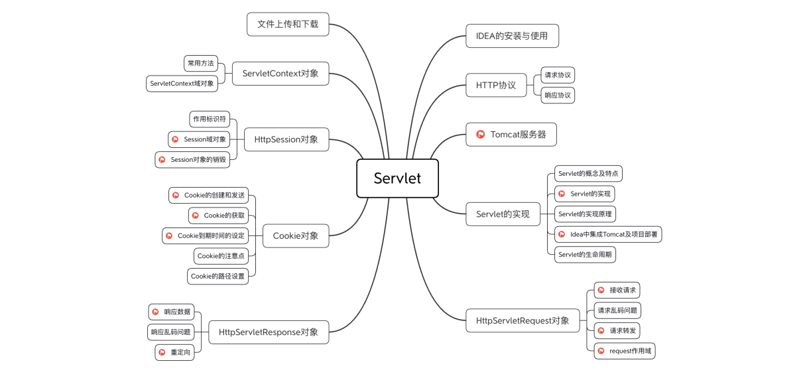

# Servlet

[学习视频地址](https://www.bilibili.com/video/BV1ZC4y1t7Aa?from=search&seid=8683124770659686534&spm_id_from=333.337.0.0)

主要内容

::: tip

如果8080端口被占用

第一种方法，更改tomcat端口：进入tomcat安装目录\conf文件夹，以记事本打开service.xml，指定新的端口号并重启tomcat。(推荐)

第二种方法，以管理员身份运行cmd,输入netstat -aon|findstr "8080" 然后taskkill /pid 进程号 -t -f杀死占用8080端口的进程号,重启服务器即可。

:::

<Vssue title="Vssue Demo10"/>

