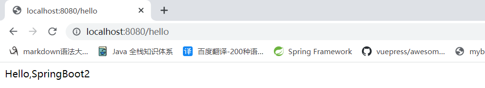
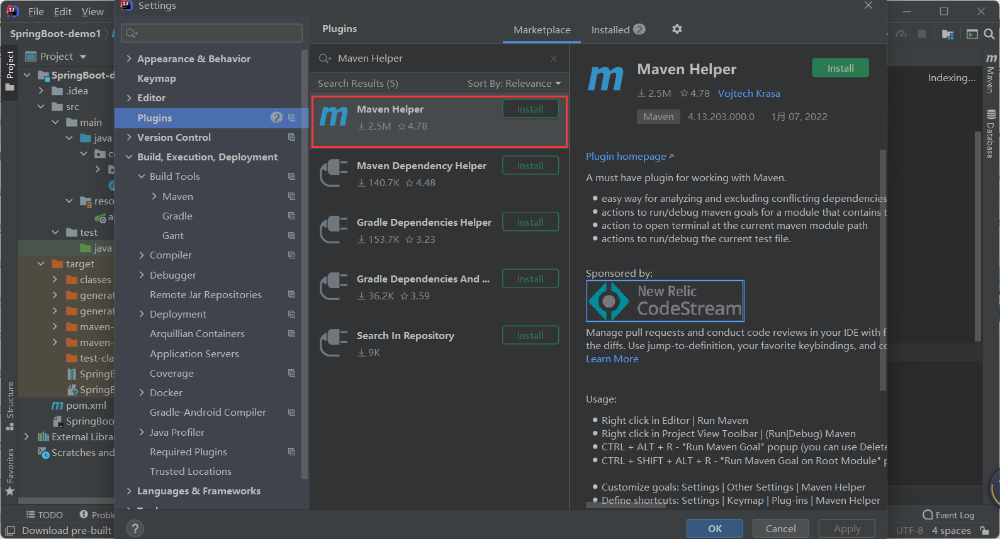
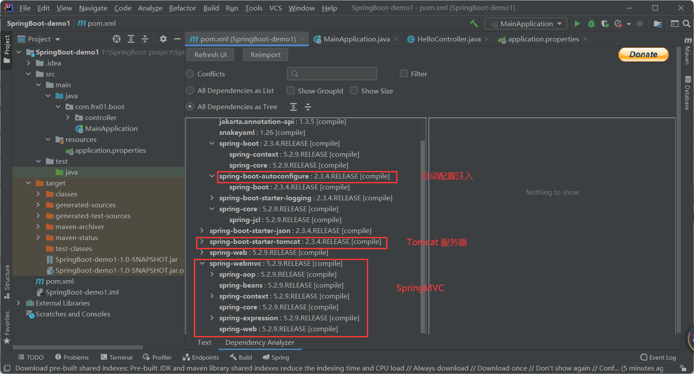
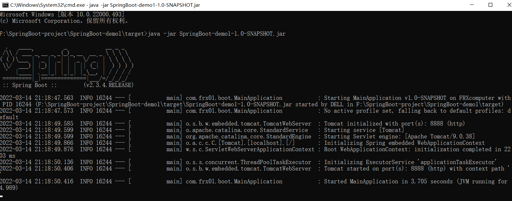
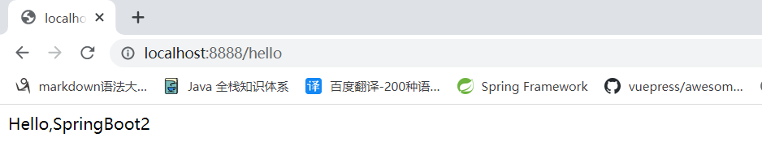

# SpringBoot2 快速入门

[[toc]]

+ [官方文档](https://docs.spring.io/spring-boot/docs/current/reference/html/getting-started.html#getting-started)

## 系统要求

+ Java8&兼容Java14
+ Maven3.3及以上
+ idea 2019.1.2

### maven设置

```xml
<mirrors>
      <mirror>
        <id>nexus-aliyun</id>
        <mirrorOf>central</mirrorOf>
        <name>Nexus aliyun</name>
        <url>http://maven.aliyun.com/nexus/content/groups/public</url>
      </mirror>
  </mirrors>
 
  <profiles>
         <profile>
              <id>jdk-1.8</id>
              <activation>
                <activeByDefault>true</activeByDefault>
                <jdk>1.8</jdk>
              </activation>
              <properties>
                <maven.compiler.source>1.8</maven.compiler.source>
                <maven.compiler.target>1.8</maven.compiler.target>
                <maven.compiler.compilerVersion>1.8</maven.compiler.compilerVersion>
              </properties>
         </profile>
  </profiles>
```

## HelloWorld

需求：浏览发送/hello请求，响应 Hello，Spring Boot 2 

### 创建maven工程

### 引入依赖

```xml
    <parent>
        <groupId>org.springframework.boot</groupId>
        <artifactId>spring-boot-starter-parent</artifactId>
        <version>2.3.4.RELEASE</version>
    </parent>

    <dependencies>
        <!--web场景启动器-->
        <dependency>
            <groupId>org.springframework.boot</groupId>
            <artifactId>spring-boot-starter-web</artifactId>
        </dependency>
    </dependencies>
```

### 创建主程序

```java
/**
 * @author frx
 * @version 1.0
 * @date 2022/3/14  18:14
 * 主程序类 这是一个SpringBoot应用
 */
//告诉SpringBoot,这是一个SpringBoot应用
@SpringBootApplication
public class MainApplication {
    public static void main(String[] args) {
        SpringApplication.run(MainApplication.class,args);
    }
}
```

### 编写业务

`controller层`

```java
/**
 * @author frx
 * @version 1.0
 * @date 2022/3/14  18:57
 */
//@ResponseBody //返回一段话，而不是跳转到某个页面
//@Controller
@RestController  //@ResponseBody与@Controller的合体
public class HelloController {


    @RequestMapping("/hello") //映射请求
    public String handle01(){
        return "Hello,SpringBoot2"; //向浏览器返回
    }
}
```

### 测试

运行main方法,结果如下:

+ 控制台

```java

  .   ____          _            __ _ _
 /\\ / ___'_ __ _ _(_)_ __  __ _ \ \ \ \
( ( )\___ | '_ | '_| | '_ \/ _` | \ \ \ \
 \\/  ___)| |_)| | | | | || (_| |  ) ) ) )
  '  |____| .__|_| |_|_| |_\__, | / / / /
 =========|_|==============|___/=/_/_/_/
 :: Spring Boot ::        (v2.3.4.RELEASE)

2022-03-14 20:15:14.512  INFO 300 --- [           main] com.frx01.boot.MainApplication           : Starting MainApplication on FRXcomputer with PID 300 (F:\SpringBoot-project\SpringBoot-demo1\target\classes started by DELL in F:\SpringBoot-project\SpringBoot-demo1)
2022-03-14 20:15:14.520  INFO 300 --- [           main] com.frx01.boot.MainApplication           : No active profile set, falling back to default profiles: default
2022-03-14 20:15:15.312  INFO 300 --- [           main] o.s.b.w.embedded.tomcat.TomcatWebServer  : Tomcat initialized with port(s): 8080 (http)
2022-03-14 20:15:15.318  INFO 300 --- [           main] o.apache.catalina.core.StandardService   : Starting service [Tomcat]
2022-03-14 20:15:15.318  INFO 300 --- [           main] org.apache.catalina.core.StandardEngine  : Starting Servlet engine: [Apache Tomcat/9.0.38]
2022-03-14 20:15:15.368  INFO 300 --- [           main] o.a.c.c.C.[Tomcat].[localhost].[/]       : Initializing Spring embedded WebApplicationContext
2022-03-14 20:15:15.368  INFO 300 --- [           main] w.s.c.ServletWebServerApplicationContext : Root WebApplicationContext: initialization completed in 772 ms
2022-03-14 20:15:15.481  INFO 300 --- [           main] o.s.s.concurrent.ThreadPoolTaskExecutor  : Initializing ExecutorService 'applicationTaskExecutor'
2022-03-14 20:15:15.713  INFO 300 --- [           main] o.s.b.w.embedded.tomcat.TomcatWebServer  : Tomcat started on port(s): 8080 (http) with context path ''
2022-03-14 20:15:15.779  INFO 300 --- [           main] com.frx01.boot.MainApplication           : Started MainApplication in 1.563 seconds (JVM running for 2.484)
2022-03-14 20:18:01.580  INFO 300 --- [nio-8080-exec-1] o.a.c.c.C.[Tomcat].[localhost].[/]       : Initializing Spring DispatcherServlet 'dispatcherServlet'
2022-03-14 20:18:01.580  INFO 300 --- [nio-8080-exec-1] o.s.web.servlet.DispatcherServlet        : Initializing Servlet 'dispatcherServlet'
2022-03-14 20:18:01.591  INFO 300 --- [nio-8080-exec-1] o.s.web.servlet.DispatcherServlet        : Completed initialization in 11 ms
```

+ 访问URL



> 非常非常的好用，非常非常的奈斯，非常非常的妙

### 一些思考

> 到此，你会发现一个简单的web程序居然完成了。这里你需要一些思考：

### 为什么我们添加一个starter-web模块便可以了呢？

我们安装Maven Helper的插件，用来查看spring-boot-starter-web模块的依赖



我们看下这个模块的依赖，你便能初步窥探出模块支撑



### 我们如何更改更多Server的配置呢？比如Tomcat Server

为什么Tomcat默认端口是8080？ 如前文所述，SpringBoot最强大的地方在于约定大于配置，只要你引入某个模块的xx-start包，它将自动注入配置，提供了这个模块的功能；比如这里我们在POM中添加了如下的包

```xml
<dependencies>
        <!--web场景启动器-->
        <dependency>
            <groupId>org.springframework.boot</groupId>
            <artifactId>spring-boot-starter-web</artifactId>
        </dependency>
    </dependencies>
```

它内嵌了Tomcat并且提供了默认的配置，比如默认端口是8080.

我们可以在application.properties或者application.yml中配置

### 简化配置

`application.properties`

```properties
server.port=8888
```

### 简化部署

```xml
 <build>
        <plugins>
            <plugin>
                <groupId>org.springframework.boot</groupId>
                <artifactId>spring-boot-maven-plugin</artifactId>
            </plugin>
        </plugins>
    </build>
```

**把项目打成jar包，直接在目标服务器执行即可**。



+ 访问URL



::: tip

取消掉cmd的快速编辑模式

:::