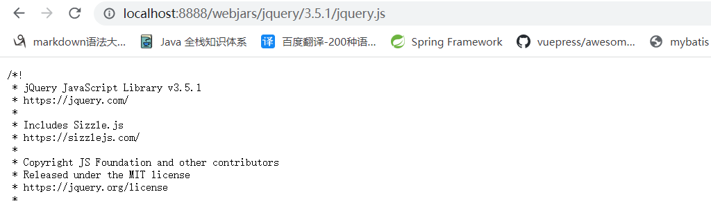
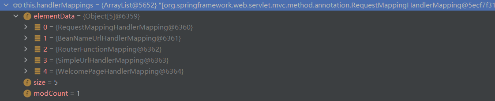
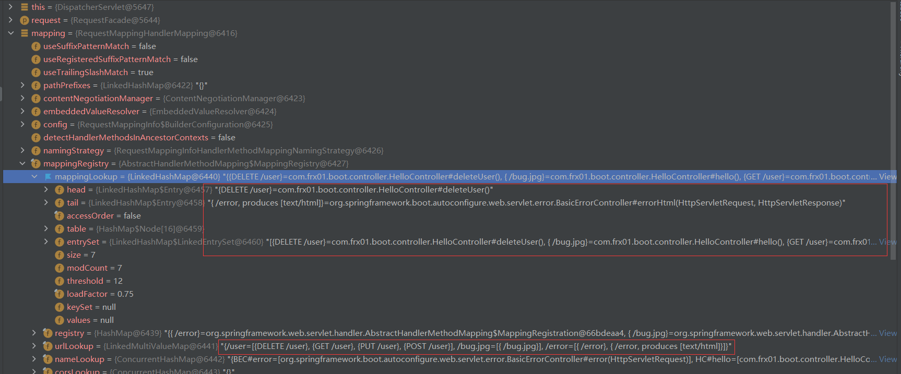
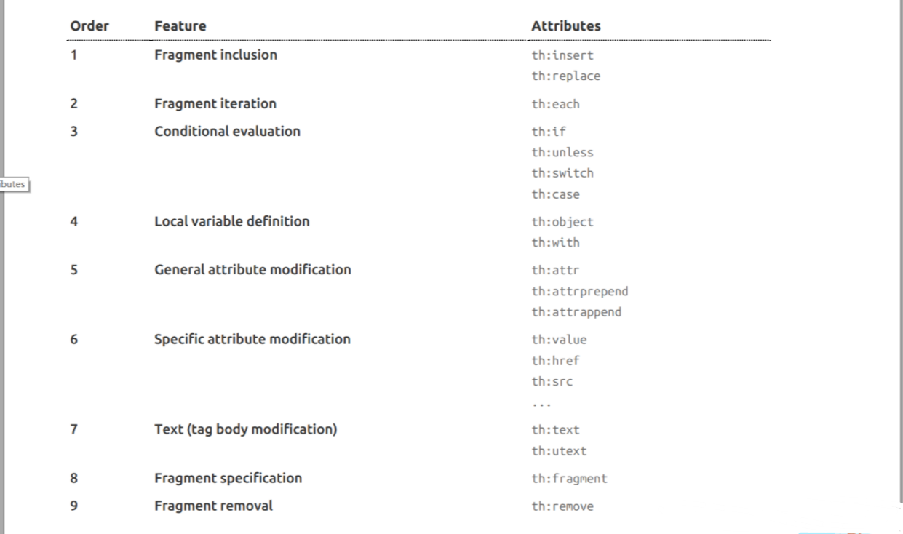
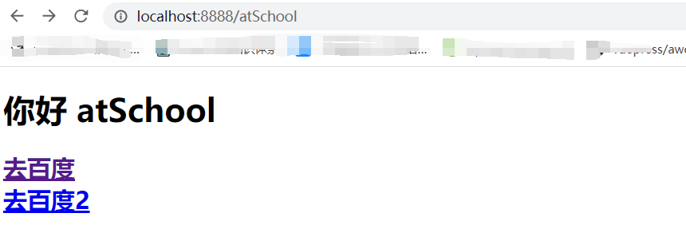

# Web开发

[[toc]]

+ [官方文档](https://docs.spring.io/spring-boot/docs/current/reference/html/web.html#web.servlet.spring-mvc)

## SpringMVC自动配置概览

Spring Boot provides auto-configuration for Spring MVC that **works well with most applications.(大多场景我们都无需自定义配置)**

The auto-configuration adds the following features on top of Spring’s defaults:

- Inclusion of `ContentNegotiatingViewResolver` and `BeanNameViewResolver` beans.
  - 内容协商视图解析器和BeanName视图解析器
- Support for serving static resources, including support for WebJars (covered [later in this document](https://docs.spring.io/spring-boot/docs/current/reference/html/spring-boot-features.html#boot-features-spring-mvc-static-content))).
  - 静态资源（包括webjars）
- Automatic registration of `Converter`, `GenericConverter`, and `Formatter` beans.
  - 自动注册 `Converter，GenericConverter，Formatter `
- Support for `HttpMessageConverters` (covered [later in this document](https://docs.spring.io/spring-boot/docs/current/reference/html/spring-boot-features.html#boot-features-spring-mvc-message-converters)).
  - 支持 `HttpMessageConverters` （后来我们配合内容协商理解原理）
- Automatic registration of `MessageCodesResolver` (covered [later in this document](https://docs.spring.io/spring-boot/docs/current/reference/html/spring-boot-features.html#boot-features-spring-message-codes)).
  - 自动注册 `MessageCodesResolver` （国际化用）
- Static `index.html` support.
  - 静态index.html 页支持
- Custom `Favicon` support (covered [later in this document](https://docs.spring.io/spring-boot/docs/current/reference/html/spring-boot-features.html#boot-features-spring-mvc-favicon)).
  - 自定义 `Favicon`  
- Automatic use of a `ConfigurableWebBindingInitializer` bean (covered [later in this document](https://docs.spring.io/spring-boot/docs/current/reference/html/spring-boot-features.html#boot-features-spring-mvc-web-binding-initializer)).
  - 自动使用 `ConfigurableWebBindingInitializer` ，（DataBinder负责将请求数据绑定到JavaBean上）

> If you want to keep those Spring Boot MVC customizations and make more [MVC customizations](https://docs.spring.io/spring/docs/5.2.9.RELEASE/spring-framework-reference/web.html#mvc) (interceptors, formatters, view controllers, and other features), you can add your own `@Configuration` class of type `WebMvcConfigurer` but **without** `@EnableWebMvc`.
>
> **不用@EnableWebMvc注解。使用**`@Configuration` **+** `WebMvcConfigurer` **自定义规则**

> If you want to provide custom instances of `RequestMappingHandlerMapping`, `RequestMappingHandlerAdapter`, or `ExceptionHandlerExceptionResolver`, and still keep the Spring Boot MVC customizations, you can declare a bean of type `WebMvcRegistrations` and use it to provide custom instances of those components.
>
> **声明** `WebMvcRegistrations` **改变默认底层组件**

> If you want to take complete control of Spring MVC, you can add your own `@Configuration` annotated with `@EnableWebMvc`, or alternatively add your own `@Configuration`-annotated `DelegatingWebMvcConfiguration` as described in the Javadoc of `@EnableWebMvc`.
>
> **使用** `@EnableWebMvc+@Configuration+DelegatingWebMvcConfiguration 全面接管SpringMVC`

## 简单功能分析

### 静态资源访问

只要静态资源放在类路径下： called `/static` (or `/public` or `/resources` or `/META-INF/resources`

访问 ： 当前项目根路径/ + 静态资源名

原理： `静态映射/**`。

**请求进来，先去找Controller看能不能处理。不能处理的所有请求又都交给静态资源处理器**。静态资源也找不到则响应404页面

改变默认的静态资源路径

```yaml
spring:
  mvc:
    static-path-pattern: /res/**
  web:
  resources:
    static-locations: [classpath:/haha/]
```

#### 静态资源访问前缀

默认不前缀

```yaml
spring:
  mvc:
    static-path-pattern: /res/**
```

当前项目 + static-path-pattern + 静态资源名 = 静态资源文件夹下找

#### webjar

自动映射 /[webjars](http://localhost:8080/webjars/jquery/3.5.1/jquery.js)/**

https://www.webjars.org/

```xml
	    <dependency>
            <groupId>org.webjars</groupId>
            <artifactId>jquery</artifactId>
            <version>3.5.1</version>
        </dependency>
```

访问地址：[http://localhost:8888/webjars/**jquery/3.5.1/jquery.js**](http://localhost:8080/webjars/jquery/3.5.1/jquery.js)   后面地址要按照依赖里面的包路径



### 欢迎页支持

- 静态资源路径下  index.html

  + **可以配置静态资源路径**

  - **但是不可以配置静态资源的访问前缀。否则导致 index.html不能被默认访问**


```yaml
spring:
#  mvc:
#    static-path-pattern: /res/**   这个会导致welcome page功能失效

  resources:
    static-locations: [classpath:/haha/]
```

- controller能处理/index

### 自定义 `Favicon`

favicon.ico 放在静态资源目录下即可。

```yaml
spring:
#  mvc:
#    static-path-pattern: /res/**   这个会导致 Favicon 功能失效
```

> 了解

### 静态资源配置原理

+ SpringBoot启动默认加载  xxxxAutoConfiguration 类(自动配置类)
+ SpringMVC功能的自动配置类 WebMvcAutoConfiguration，生效

```java
@Configuration(
    proxyBeanMethods = false
)
@ConditionalOnWebApplication(
    type = Type.SERVLET
)
@ConditionalOnClass({Servlet.class, DispatcherServlet.class, WebMvcConfigurer.class})
@ConditionalOnMissingBean({WebMvcConfigurationSupport.class})
@AutoConfigureOrder(-2147483638)
@AutoConfigureAfter({DispatcherServletAutoConfiguration.class, TaskExecutionAutoConfiguration.class, ValidationAutoConfiguration.class})
public class WebMvcAutoConfiguration {}
```

+ 给容器中配置了什么

```java {2}
 	@Import({WebMvcAutoConfiguration.EnableWebMvcConfiguration.class})
    @EnableConfigurationProperties({WebMvcProperties.class, ResourceProperties.class})
    @Order(0)
    public static class WebMvcAutoConfigurationAdapter implements WebMvcConfigurer {}
```

+ 配置文件的相关属性和xxx进行了绑定。WebMvcProperties\==spring.mvc、ResourceProperties==spring.resources

#### 配置类只有一个有参构造器

```java
		//有参构造器所有参数的值 都会从容器中确定
        public WebMvcAutoConfigurationAdapter(ResourceProperties resourceProperties, WebMvcProperties mvcProperties, ListableBeanFactory beanFactory, ObjectProvider<HttpMessageConverters> messageConvertersProvider, ObjectProvider<WebMvcAutoConfiguration.ResourceHandlerRegistrationCustomizer> resourceHandlerRegistrationCustomizerProvider, ObjectProvider<DispatcherServletPath> dispatcherServletPath, ObjectProvider<ServletRegistrationBean<?>> servletRegistrations) {
            this.resourceProperties = resourceProperties;
            this.mvcProperties = mvcProperties;
            this.beanFactory = beanFactory;
            this.messageConvertersProvider = messageConvertersProvider;
            this.resourceHandlerRegistrationCustomizer = (WebMvcAutoConfiguration.ResourceHandlerRegistrationCustomizer)resourceHandlerRegistrationCustomizerProvider.getIfAvailable();
            this.dispatcherServletPath = dispatcherServletPath;
            this.servletRegistrations = servletRegistrations;
        }

```

+ resourceProperties:获取和spring.resources绑定的所有的值的对象

+ WebMvcProperties mvcProperties:获取和spring.mvc绑定的所有的值的对象

+ ListableBeanFactory beanFactory:Spring的beanFactory 
+ ObjectProvider\<HttpMessageConverters> messageConvertersProvider:找到所有的HttpMessageConverters
+ ResourceHandlerRegistrationCustomizer:找到资源处理器的自定义器
+ DispatcherServletPath
+ ServletRegistrationBean:给应用注册原生的Servlet、Filter

#### 资源处理的默认规则

```java
        public void addResourceHandlers(ResourceHandlerRegistry registry) {
            if (!this.resourceProperties.isAddMappings()) {
                logger.debug("Default resource handling disabled");
            } else {
                Duration cachePeriod = this.resourceProperties.getCache().getPeriod();
                CacheControl cacheControl = this.resourceProperties.getCache().getCachecontrol().toHttpCacheControl();
                //webjars的规则
                if (!registry.hasMappingForPattern("/webjars/**")) {
                    this.customizeResourceHandlerRegistration(registry.addResourceHandler(new String[]{"/webjars/**"}).addResourceLocations(new String[]{"classpath:/META-INF/resources/webjars/"}).setCachePeriod(this.getSeconds(cachePeriod)).setCacheControl(cacheControl));
                }

                String staticPathPattern = this.mvcProperties.getStaticPathPattern();
                if (!registry.hasMappingForPattern(staticPathPattern)) {
                    this.customizeResourceHandlerRegistration(registry.addResourceHandler(new String[]{staticPathPattern}).addResourceLocations(WebMvcAutoConfiguration.getResourceLocations(this.resourceProperties.getStaticLocations())).setCachePeriod(this.getSeconds(cachePeriod)).setCacheControl(cacheControl));
                }

            }
        }
```

+ this.resourceProperties.isAddMappings():如果配成false,静态资源被禁用

```yaml
spring:
  resources:
    add-mappings: false #禁用所有静态资源
```

```java
@ConfigurationProperties(
    prefix = "spring.resources",
    ignoreUnknownFields = false
)
public class ResourceProperties {
    private static final String[] CLASSPATH_RESOURCE_LOCATIONS = new String[]{"classpath:/META-INF/resources/", "classpath:/resources/", "classpath:/static/", "classpath:/public/"};
    private String[] staticLocations;
    private boolean addMappings;
    private final ResourceProperties.Chain chain;
    private final ResourceProperties.Cache cache;

    public ResourceProperties() {
        this.staticLocations = CLASSPATH_RESOURCE_LOCATIONS;
        this.addMappings = true;
        this.chain = new ResourceProperties.Chain();
        this.cache = new ResourceProperties.Cache();
    }

    public String[] getStaticLocations() {
        return this.staticLocations;
    }
```

#### 欢迎页的规则

```java {3}
      	@Bean
        public WelcomePageHandlerMapping welcomePageHandlerMapping(ApplicationContext applicationContext, FormattingConversionService mvcConversionService, ResourceUrlProvider mvcResourceUrlProvider) {
            WelcomePageHandlerMapping welcomePageHandlerMapping = new WelcomePageHandlerMapping(new TemplateAvailabilityProviders(applicationContext), applicationContext, this.getWelcomePage(), this.mvcProperties.getStaticPathPattern());
            welcomePageHandlerMapping.setInterceptors(this.getInterceptors(mvcConversionService, mvcResourceUrlProvider));
            welcomePageHandlerMapping.setCorsConfigurations(this.getCorsConfigurations());
            return welcomePageHandlerMapping;
        }
```

+ HandlerMapping:处理器映射。保存了每一个Handler能处理哪些请求

```java
	WelcomePageHandlerMapping(TemplateAvailabilityProviders templateAvailabilityProviders, ApplicationContext applicationContext, Optional<Resource> welcomePage, String staticPathPattern) {
        if (welcomePage.isPresent() && "/**".equals(staticPathPattern)) {
            //要用欢迎页，必须是/**
            logger.info("Adding welcome page: " + welcomePage.get());
            this.setRootViewName("forward:index.html");
        } else if (this.welcomeTemplateExists(templateAvailabilityProviders, applicationContext)) {
            //调用Controller /index
            logger.info("Adding welcome page template: index");
            this.setRootViewName("index");
        }

    }
```

## 请求参数处理

### 请求映射

#### rest使用与原理

- @xxxMapping；

- Rest风格支持（*使用**HTTP**请求方式动词来表示对资源的操作*）
  - 以前：*/getUser*   *获取用户*     */deleteUser* *删除用户*    */editUser*  *修改用户*       */saveUser* *保存用户*
  - *现在： /user*    *GET-获取用户*    *DELETE-删除用户*     *PUT-修改用户*      *POST-保存用户*
  - 核心Filter；HiddenHttpMethodFilter
    - 用法： 表单method=post，隐藏域 _method=put
    - SpringBoot中手动开启

  
  - 扩展：如何把_method 这个名字换成我们自己喜欢的

```java
    @RequestMapping(value = "/user",method = RequestMethod.GET)
    public String getUser(){
        return "GET-张三";
    }

    @RequestMapping(value = "/user",method = RequestMethod.POST)
    public String saveUser(){
        return "POST-张三";
    }


    @RequestMapping(value = "/user",method = RequestMethod.PUT)
    public String putUser(){
        return "PUT-张三";
    }

    @RequestMapping(value = "/user",method = RequestMethod.DELETE)
    public String deleteUser(){
        return "DELETE-张三";
    }


	@Bean
	@ConditionalOnMissingBean(HiddenHttpMethodFilter.class)
	@ConditionalOnProperty(prefix = "spring.mvc.hiddenmethod.filter", name = "enabled", matchIfMissing = false)//默认false
	public OrderedHiddenHttpMethodFilter hiddenHttpMethodFilter() {
		return new OrderedHiddenHttpMethodFilter();
	}
```

> Rest原理(表单提交要使用REST风格)
>
> + 表单提交会带上`_method=PUT`
> + **请求过来被**HiddenHttpMethodFilter拦截
>   + 请求是否正常，并且是POST
>     + 获取到_method的值
>     + 兼容以下请求；**PUT**.**DELETE**.**PATCH**
>     + **原生request（post），包装模式requesWrapper重写了getMethod方法，返回的是传入的值。**
>     + **过滤器链放行的时候用wrapper。以后的方法调用getMethod是调用requestWrapper的**。
> ```java {2,3,4,5,6,8}
>     protected void doFilterInternal(HttpServletRequest request, HttpServletResponse response, FilterChain filterChain) throws ServletException, IOException {
>         HttpServletRequest requestToUse = request;
>         if ("POST".equals(request.getMethod()) && request.getAttribute("javax.servlet.error.exception") == null) {
>             String paramValue = request.getParameter(this.methodParam);
>             if (StringUtils.hasLength(paramValue)) {
>                 String method = paramValue.toUpperCase(Locale.ENGLISH);
>                 if (ALLOWED_METHODS.contains(method)) {
>                     requestToUse = new HiddenHttpMethodFilter.HttpMethodRequestWrapper(request, method);
>                 }
>             }
>         }
> 
>         filterChain.doFilter((ServletRequest)requestToUse, response);
>     }
> ```

**Rest使用客户端工具**

+ 如PostMan直接发送Put、delete等方式请求，无需Filter。

```yaml
spring:
  mvc:
    hiddenmethod:
      filter:
        enabled: true   #开启页面表单的Rest功能
```

> @GetMapping相当于@RequestMapping(method=RequestMethod.GET)

+ 自定义filter

```java
@Configuration
public class WebConfig {

    @Bean
    public HiddenHttpMethodFilter hiddenHttpMethodFilter(){
        HiddenHttpMethodFilter methodFilter=new HiddenHttpMethodFilter();
        methodFilter.setMethodParam("_m");
        return methodFilter;
    }
}
```

#### 请求映射原理


SpringMVC功能分析都从 org.springframework.web.servlet.DispatcherServlet->doDispatch()

```java {16}
    protected void doDispatch(HttpServletRequest request, HttpServletResponse response) throws Exception {
        HttpServletRequest processedRequest = request;
        HandlerExecutionChain mappedHandler = null;
        boolean multipartRequestParsed = false;
        WebAsyncManager asyncManager = WebAsyncUtils.getAsyncManager(request);

        try {
            try {
                ModelAndView mv = null;
                Object dispatchException = null;

                try {
                    processedRequest = this.checkMultipart(request);
                    multipartRequestParsed = processedRequest != request;
                    //找到当前请求使用哪个Handler(Controller的方法)处理
                    mappedHandler = this.getHandler(processedRequest);
                	//HandlerMapping:处理器映射/***->xxx
```

```java {3}
    @Nullable
    protected HandlerExecutionChain getHandler(HttpServletRequest request) throws Exception {
        if (this.handlerMappings != null) {
            Iterator var2 = this.handlerMappings.iterator();

            while(var2.hasNext()) {
                HandlerMapping mapping = (HandlerMapping)var2.next();
                HandlerExecutionChain handler = mapping.getHandler(request);
                if (handler != null) {
                    return handler;
                }
            }
        }

        return null;
    }
```



**RequestMappingHandlerMapping**:保存了所有@RequestMapping和handler的映射规则。



所有的请求映射都保存在HandlerMapping中

+ SpringBoot自动配置欢迎页的WelcomePageHandlerMaping。访问/能访问到index.html
+ SpringBoot自动配置了默认的RequestMappingHandlerMapping
+ 请求进来，挨个尝试所有的HandlerMapping看是否有请求信息。
  + 如果有就找到这个请求对应的handler
  + 如果没有就是下一个HandlerMapping
+ 我们需要一些自定义的映射处理，我们也可以自己给容器中放**HandlerMapping**。自定义**HandlerMapping**

### 普通参数与基本注解

+ **注解**:

@PathVariable、@RequestHeader、@ModelAttribute、@RequestParam、@MatrixVariable、@CookieValue、@RequestBody

```java
/**
 * @author frx
 * @version 1.0
 * @date 2022/3/31  16:25
 */
@RestController
public class ParameterTestController {

    // /car/2/owner/zhangsan
    @GetMapping("/car/{id}/owner/{username}")
    public Map<String,Object> getCar(@PathVariable("id") Integer id,
                                     @PathVariable("username") String name,
                                     @PathVariable Map<String,String> pv,
                                     @RequestHeader("User-Agent") String userAgent,
                                     @RequestHeader Map<String,String> header,
                                     @RequestParam("age") Integer age,
                                     @RequestParam("inters") List<String> inters,
                                     @RequestParam Map<String,String> params,
                                     @CookieValue("_ga") String _ga,
                                     @CookieValue("_ga") Cookie cookie){
        HashMap<String, Object> map= new HashMap<>();
//        map.put("id",id);
//        map.put("name",name);
//        map.put("pv",pv);
//        map.put("userAgent",userAgent);
//        map.put("headers",header);
        map.put("age",age);
        map.put("inters",inters);
        map.put("params",params);
        map.put("_ga",_ga);
        System.out.println(cookie.getName()+"-->"+cookie.getValue());
        return map;

    }
    @PostMapping("/save")
    public Map postMethod(@RequestBody String content){
        HashMap<String, Object> map = new HashMap<>();
        map.put("content",content);
        return map;
    }
}
```

```java
/**
 * @author frx
 * @version 1.0
 * @date 2022/3/31  21:17
 */
@Controller
public class RequestController {

    @GetMapping("/goto")
    public String goToPage(HttpServletRequest request){
        request.setAttribute("msg","成功了...");
        request.setAttribute("code",200);
        return "forward:/success";  //转发到 /success请求
    }

    @ResponseBody
    @GetMapping("/success")
    public Map success(@RequestAttribute("msg") String msg,
                       @RequestAttribute("code") Integer code,
                       HttpServletRequest request){
        Object msg1 = request.getAttribute("msg");
        HashMap<String, Object> map = new HashMap<>();
        map.put("reqMethod_msg",msg1);
        map.put("annotation_msg",msg);
        return map;
    }
}

```

#### 矩阵变量

1. 语法： 请求路径：/cars/sell;low=34;brand=byd,audi,yd
2. SpringBoot默认是禁用了矩阵变量的功能
   + 手动开启：原理。对于路径的处理。UrlPathHelper进行解析。
     + removeSemicolonContent（移除分号内容）支持矩阵变量的
3. 矩阵变量必须有url路径变量才能被解析

> /cars/{path}?xxx=xxx&aaa=ccc queryString 查询字符串。@RequestParam；
>
> /cars/sell;low=34;brand=byd,audi,yd  ；矩阵变量
>
> 页面开发，cookie禁用了，session里面的内容怎么使用；
>
> session.set(a,b)----> jsessionid ----> cookie ----> 每次发请求携带。
>
> url重写：/abc;jsesssionid=xxxx 把cookie的值使用矩阵变量的方式进行传递.

+ 开启矩阵变量功能-方法一:

```java
@Configuration
public class WebConfig{
	@Bean
    public WebMvcConfigurer webMvcConfigurer(){
        return new WebMvcConfigurer() {
            @Override
            public void configurePathMatch(PathMatchConfigurer configurer) {
                UrlPathHelper urlPathHelper = new UrlPathHelper();
                urlPathHelper.setRemoveSemicolonContent(false);
                configurer.setUrlPathHelper(urlPathHelper);
            }
        };
    }
}
```

+ 开启矩阵变量功能-方法二:

```java
@Configuration
public class WebConfig implements WebMvcConfigurer {
 	@Override
    public void configurePathMatch(PathMatchConfigurer configurer) {
        UrlPathHelper urlPathHelper = new UrlPathHelper();
        //不移除;后面的内容
        urlPathHelper.setRemoveSemicolonContent(false);
        configurer.setUrlPathHelper(urlPathHelper);
    }
}
```

+ 测试

```java
@RestController
public class ParameterTestController { 	
	//1.语法: /cars/sell;low=34;brand=byd,audi,yd
    //2.SpringBoot默认是禁用了矩阵变量的功能
    //     手动开启:原理.对于路径的处理。
    //3.矩阵变量必须有url路径变量才能被解析
    @GetMapping("/cars/{path}")
    public Map carsSell(@MatrixVariable("low") Integer low,
                        @MatrixVariable("brand") List<String> brand,
                        @PathVariable("path") String path){
        HashMap<String, Object> map = new HashMap<>();
        map.put("low",low);
        map.put("brand",brand);
        map.put("path",path);
        return map;

    }

    // /boss/1;age=20/2;age=10
    @GetMapping("/boss/{bossId}/{empId}")
    public Map boss(@MatrixVariable(value ="age",pathVar = "bossId") Integer bossAge,
                    @MatrixVariable(value = "age",pathVar = "empId") Integer empAge){
        HashMap<String, Object> map = new HashMap<>();
        map.put("bossAge",bossAge);
        map.put("empAge",empAge);
        return map;
    }
}
```

## 视图解析与模板引擎

视图解析:**SpringBoot默认不支持 JSP，需要引入第三方模板引擎技术实现页面渲染。**

###                      视图解析

+ 视图处理方式
  + 转发
  + 重定向
  + 自定义视图

#### 模板引擎-Thymeleaf

#### thymeleaf简介

+ [官方文档](https://www.thymeleaf.org/documentation.html)

Thymeleaf is a modern server-side Java template engine for both web and standalone environments, capable of processing HTML, XML, JavaScript, CSS and even plain text.

**现代化、服务端Java模板引擎**

### 基本语法

#### 表达式

| 表达式名字 | 语法   | 用途                            |
| ---------- | ------ | ------------------------------- |
| 变量取值   | ${...} | 获取请求域、session域、对象等值 |
| 选择变量   | *{...} | 获取上下文对象值                |
| 消息       | #{...} | 获取国际化等值                  |
| 链接       | @{...} | 生成链接                        |
| 片段表达式 | ~{...} | jsp:include 作用，引入公共      |

### 字面量

文本值: **'one text'** **,** **'Another one!'** **,…**数字: **0** **,** **34** **,** **3.0** **,** **12.3** **,…**布尔值: **true** **,** **false**

空值: **null**

变量： one，two，.... 变量不能有空格

### 文本操作

字符串拼接: **+**

变量替换: **|The name is ${name}|** 

### 数学运算

运算符: + , - , * , / , %

#### 布尔运算

运算符:  **and** **,** **or**

一元运算: **!** **,** **not** 

#### 比较运算

比较: **>** **,** **<** **,** **>=** **,** **<=** **(** **gt** **,** **lt** **,** **ge** **,** **le** **)**等式: **==** **,** **!=** **(** **eq** **,** **ne** **)** 

#### 条件运算

If-then: **(if) ? (then)**

If-then-else: **(if) ? (then) : (else)**

Default: (value) **?: (defaultvalue)** 

#### 特殊操作

无操作： _

#### 设置属性值-th:attr

设置单个值

```html
<form action="subscribe.html" th:attr="action=@{/subscribe}">
  <fieldset>
    <input type="text" name="email" />
    <input type="submit" value="Subscribe!" th:attr="value=#{subscribe.submit}"/>
  </fieldset>
</form>
```

设置多个值

```html

```

以上两个的代替写法 th:xxxx

```html
<input type="submit" value="Subscribe!" th:value="#{subscribe.submit}"/>
<form action="subscribe.html" th:action="@{/subscribe}">
```

所有h5兼容的标签写法

https://www.thymeleaf.org/doc/tutorials/3.0/usingthymeleaf.html#setting-value-to-specific-attributes

#### 迭代

```html
<tr th:each="prod : ${prods}">
        <td th:text="${prod.name}">Onions</td>
        <td th:text="${prod.price}">2.41</td>
        <td th:text="${prod.inStock}? #{true} : #{false}">yes</td>
</tr>
```

```html
<tr th:each="prod,iterStat : ${prods}" th:class="${iterStat.odd}? 'odd'">
  <td th:text="${prod.name}">Onions</td>
  <td th:text="${prod.price}">2.41</td>
  <td th:text="${prod.inStock}? #{true} : #{false}">yes</td>
</tr>
```

#### 条件运算

```html
<a href="comments.html"
th:href="@{/product/comments(prodId=${prod.id})}"
th:if="${not #lists.isEmpty(prod.comments)}">view</a>
```

```html
<div th:switch="${user.role}">
  <p th:case="'admin'">User is an administrator</p>
  <p th:case="#{roles.manager}">User is a manager</p>
  <p th:case="*">User is some other thing</p>
</div>
```

#### 属性优先级



### thymeleaf使用

#### 引入Starter

```xml
        <dependency>
            <groupId>org.springframework.boot</groupId>
            <artifactId>spring-boot-starter-thymeleaf</artifactId>
        </dependency>
```

#### 自动配置好了thymeleaf

```java
@Configuration(proxyBeanMethods = false)
@EnableConfigurationProperties(ThymeleafProperties.class)
@ConditionalOnClass({ TemplateMode.class, SpringTemplateEngine.class })
@AutoConfigureAfter({ WebMvcAutoConfiguration.class, WebFluxAutoConfiguration.class })
public class ThymeleafAutoConfiguration { }
```

自动配好的策略

- 所有thymeleaf的配置值都在 ThymeleafProperties
- 配置好了 **SpringTemplateEngine** 
- **配好了** **ThymeleafViewResolver** 
- 我们只需要直接开发页面

```java
    public static final String DEFAULT_PREFIX = "classpath:/templates/";
    public static final String DEFAULT_SUFFIX = ".html"; //xxx.html
```

#### 页面开发

+ View层

```html
<!DOCTYPE html>
<html lang="en" xmlns:th="http://www.thymeleaf.org">
<head>
    <meta charset="UTF-8">
    <title>Title</title>
</head>
<body>
<h1 th:text="${msg}">哈哈</h1>
<h2>
    <a href="www.atguigu.com" th:href="${link}">去百度</a>  <br/>
    <a href="www.atguigu.com" th:href="@{link}">去百度2</a>
</h2>
</body>
</html>
```

+ 控制层

```java
/**
 * @author frx
 * @version 1.0
 * @date 2022/4/2  0:17
 */
@Controller
public class ViewTestController {

    @GetMapping("/atSchool")
    public String atSchool(Model model){
        //model中的数据会被放到请求域中 request.setAttribute("a",aa)
        model.addAttribute("msg","你好 atSchool");
        model.addAttribute("link","http://www.baidu.com");
        return "success";
    }
}
```

+ View层

```html
<!DOCTYPE html>
<html lang="en" xmlns:th="http://www.thymeleaf.org">
<head>
    <meta charset="UTF-8">
    <title>Title</title>
</head>
<body>
<h1 th:text="${msg}">哈哈</h1>
<h2>
    <a href="www.atguigu.com" th:href="${link}">去百度</a>  <br/>
    <a href="www.atguigu.com" th:href="@{link}">去百度2</a>
</h2>
</body>
</html>
```

+ 测试结果



### 构建后台管理项目

#### 项目创建

thymeleaf、web-starter、devtools、lombok

#### 静态资源处理

自动配置好，我们只需要把所有静态资源放到 static 文件夹下

#### 路径构建

th:action="@{/login}"

#### 页面跳转

```java
/**
 * @author frx
 * @version 1.0
 * @date 2022/4/3  17:27
 */
@Controller
public class IndexController {

    /**
     * 来登录页
     * @return
     */
    @GetMapping(value = {"/","/login"})
    public String loginPage(){
        return "login";
    }

    @PostMapping("/login")
    public String main(User user, HttpSession session, Model model){

        if(!StringUtils.isEmpty(user.getUserName())&&"123456".equals(user.getPassword())){
            //把登陆成功的用户保存起来
            session.setAttribute("loginUser",user);
            //登陆成功重定向到main.html;重定向防止表单重复提交
            return "redirect:/main.html";
        }else {
            model.addAttribute("msg","账号密码错误");
            //回到登录页
            return "login";
        }
    }

    /**
     * 去main页面
     * @return
     */
    @GetMapping("/main.html")
    public String mainPage(HttpSession session,Model model){
        //是否登录 拦截器，过滤器
        Object loginUser = session.getAttribute("loginUser");
        if(loginUser!=null){
            return "main";
        }else {
            //回到登录页
            model.addAttribute("msg","请重新登录");
            return "login";
        }
    }
}
```

