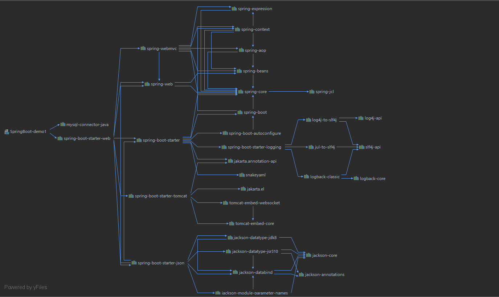

# 了解自动装配原理

[[toc]]

## SpringBoot特点

### 依赖管理

+ 依赖管理

```xml
  	<!--依赖管理-->
	<parent>
        <groupId>org.springframework.boot</groupId>
        <artifactId>spring-boot-starter-parent</artifactId>
        <version>2.3.4.RELEASE</version>
    </parent>
	<!--它的父项目-->
	<parent>
    	<groupId>org.springframework.boot</groupId>
    	<artifactId>spring-boot-dependencies</artifactId>
    	<version>2.3.4.RELEASE</version>
    </parent>
	<!--几乎声明了所有开发中几乎常用的jar的版本号，自动版本仲裁机制-->
```

+ 开发导入starter场景启动器

1. 见到很多spring-boot-starter-*:\*就是某种场景
2. 只要引入starter,**这个场景的所有常规需要的依赖**我们都会自动引入

3. SpringBoot所有支持的[场景](https://docs.spring.io/spring-boot/docs/current/reference/html/using-spring-boot.html#using-boot-starter)
4. 见到的  *-spring-boot-starter： 第三方为我们提供的简化开发的场景启动器。
5. 所有场景启动器最底层的依赖

```xml
  	<dependency>
      	<groupId>org.springframework.boot</groupId>
      	<artifactId>spring-boot-starter</artifactId>
      	<version>2.3.4.RELEASE</version>
      	<scope>compile</scope>
    </dependency>
```

+ 查看spring-boot-starter-web的分析依赖树



+ 无需关注版本号，**自动版本仲裁**

1. 引入依赖默认都可以不写版本
2. 引入非版本仲裁的jar,一定要写版本号

+ 可以修改版本号

1. 查看spring-boot-dependencies里面规定当前依赖版本用的key
2. 在当前项目里面重写配置

```xml
 	<properties>
        <mysql.version>5.1.43</mysql.version>
    </properties>
```

### 自动配置

+ 自动配好Tomcat
  + 引入Tmocat依赖
  + 配置Tomcat

```xml
  	<dependency>
      	<groupId>org.springframework.boot</groupId>
      	<artifactId>spring-boot-starter</artifactId>
      	<version>2.3.4.RELEASE</version>
      	<scope>compile</scope>
    </dependency>
```

+ **自动配好SpringMVC**

  + 引入SpringMVC全套组件
  + 自动配好SpringMVC常用组件(功能)

+ **自动配好Web常见功能**，如:字符编码问题

  + SpringBoot帮我们配置好了所有web开发的常见场景

+ 默认的包结构

  + **主程序所在包及其下面的所有子包里面的组件**都会被默认扫描进来

  + 无需以前的包扫描

  + 如果想要改变扫描路径,

    + @SpringBootApplication(scanBasePackages = "com.frx01")

    + 或者@ComponentScan指定扫描路径

    + 

      ```java
      @SpringBootConfiguration
      @EnableAutoConfiguration
      @ComponentScan("com.frx01")
      ```

+ **各种配置拥有默认值**
  + 默认配置最终都是映射到MultipartProperties
  + 配置文件的值最终会绑定每个类上，这个类会在容器中创建对象
+ **按需加载所有自动配置项**
  + 非常多的starter
  + 引入了哪些场景这个场景的自动配置才会开启
  + SpringBoot所有的自动配置功能都在spring-boot-autoconfigure包里面

## 容器功能

### 组件添加

#### **@Configuration**

+ 基本使用
+ Full模式与Lite模式
  + 示例
  + 最佳实践
    + 配置类组件之间无依赖关系用Lite模式加速容器启动过程，减少判断
    + 配置类组件之间有依赖关系，方法会被调用得到之前单实例组件，用Full模式

```java
/**
 * @author frx
 * @version 1.0
 * @date 2022/3/17  14:56
 */

/**
 * #############################Configuration使用示例######################################################
 * 1.配置类里面可以使用@Bean标注在方法上给容器注册组件，默认也是单实例的
 * 2.配置类本身也是组件
 * 3.proxyBeanMethods：代理bean的方法
 *          Full(proxyBeanMethods = true)、【保证每个@Bean方法被调用多少次返回的组件都是单实例的】
 *          Lite(proxyBeanMethods = false)【每个@Bean方法被调用多少次返回的组件都是新创建的】
 *          组件依赖必须使用Full模式默认。其他默认是否Lite模式
 */
@Configuration(proxyBeanMethods = false)//告诉SpringBoot这是一个配置类 == 配置文件
public class MyConfig {

    /**
     * Full:外部无论对配置类中的这个组件注册方法调用多少次获取到都是之前注册容器中的单实例对象
     * @return
     */
    @Bean //给容器中添加组件。以方法名作为组件id。返回类型:就是组件类型。返回的值，就是组件中在容器中的实例
    public User user01(){
        User zhangsan = new User("zhangsan", 18);
        //User组件依赖了Pet组件
        zhangsan.setPet(tomcatPet());
        return new User("zhangsan",18);
    }

    @Bean("tom") //自定义组件名
    public Pet tomcatPet(){
        return new Pet("tomcat");

    }

}
```

+ 测试代码

```java
@SpringBootConfiguration
@EnableAutoConfiguration
@ComponentScan("com.frx01")
public class MainApplication {

    public static void main(String[] args) {

        //1.返回我们的IOC容器
        ConfigurableApplicationContext run= SpringApplication.run(MainApplication.class,args);

        //2.查看容器里面的组件
        String[] names = run.getBeanDefinitionNames();
        for (String name : names) {
            System.out.println(name);
        }

        //3.从容器中获得组件

        Pet tom01 = run.getBean("tom", Pet.class);

        Pet tom02 = run.getBean("tom", Pet.class);

        System.out.println("组件: "+(tom01==tom02));

        //com.frx01.boot.config.MyConfig$$EnhancerBySpringCGLIB$$dd2d6a55@6bfdb014
        MyConfig bean = run.getBean(MyConfig.class);
        System.out.println(bean);

        //如果@Configuration(proxyBeanMethods=true)代理对象调用方法。SpringBoot总会检查这个组件是否在容器中有
        //也就是，保持组件单实例
        User user=bean.user01();
        User user1=bean.user01();
        System.out.println(user==user1);

        User user01 = run.getBean("user01", User.class);
        Pet tom = run.getBean("tom", Pet.class);
        System.out.println("用户的宠物是不是容器中的宠物:"+(user01.getPet()==tom));


    }
}
```

+ 控制台输出

```java
...
multipartConfigElement
multipartResolver
spring.servlet.multipart-org.springframework.boot.autoconfigure.web.servlet.MultipartProperties
org.springframework.aop.config.internalAutoProxyCreator
组件: true
com.frx01.boot.config.MyConfig$$EnhancerBySpringCGLIB$$eb877df3@5b69d40d
true
用户的宠物是不是容器中的宠物:false
```

