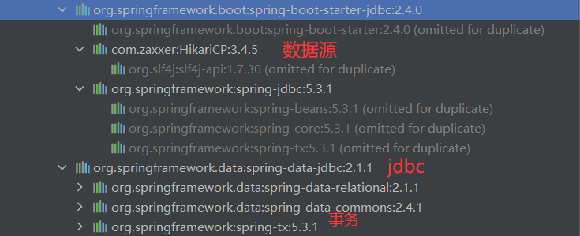

# 数据访问

[[toc]]

## SQL

### 数据源的自动配置-**HikariDataSource**

#### 导入JDBC场景

```xml
   <dependency>
            <groupId>org.springframework.boot</groupId>
            <artifactId>spring-boot-starter-data-jdbc</artifactId>
        </dependency>
```



数据库驱动？

为什么导入JDBC场景，官方不导入驱动？官方不知道我们接下要操作什么数据库。

数据库版本和驱动版本对应

```xml
<!-- 默认版本：<mysql.version>8.0.22</mysql.version> -->

        <dependency>
            <groupId>mysql</groupId>
            <artifactId>mysql-connector-java</artifactId>
<!--            <version>5.1.49</version>-->
        </dependency>
```

想要修改版本

1. 直接依赖引入具体版本（maven的就近依赖原则）
2. 重新声明版本（maven的属性的就近优先原则）

```xml
 <properties>
        <java.version>1.8</java.version>
        <mysql.version>5.1.49</mysql.version>
    </properties>
```

#### 分析自动配置

**自动配置的类**

+ DataSourceAutoConfiguration:数据源的自动配置
  + 修改数据源相关的配置:**spring.datasource**
  + 数据库连接池的配置,是自己容器中没有DataSource才自动配置
  + 底层配置好的连接池是:**HikariDataSource**

```java
	@Configuration(proxyBeanMethods = false)
	@Conditional(PooledDataSourceCondition.class)
	@ConditionalOnMissingBean({ DataSource.class, XADataSource.class })
	@Import({ DataSourceConfiguration.Hikari.class, DataSourceConfiguration.Tomcat.class,
			DataSourceConfiguration.Dbcp2.class, DataSourceConfiguration.OracleUcp.class,
			DataSourceConfiguration.Generic.class, DataSourceJmxConfiguration.class })
	protected static class PooledDataSourceConfiguration
```

+ DataSourceTransactionManagerAutoConfiguration： 事务管理器的自动配置
+ jdbcTemplateAutoConfiguration： **JdbcTemplate的自动配置，可以来对数据库进行crud**
  + 可以修改这个配置项@ConfigurationProperties(prefix = **"spring.jdbc"**)来修改JdbcTemplate
  + @Bean@Primary    JdbcTemplate；容器中有这个组件
+ JndiDataSourceAutoConfiguration： jndi的自动配置
+ XADataSourceAutoConfiguration： 分布式事务相关的

#### 修改配置项

```yaml
spring:
  datasource:
    url: jdbc:mysql://localhost:3306/maven
    username: root
    password: hsp
    driver-class-name: com.mysql.jdbc.Driver
```

#### 测试

```java
@Slf4j
@SpringBootTest
class Boot05WebAdminApplicationTests {

    @Autowired
    JdbcTemplate jdbcTemplate;

    @Test
    void contextLoads() {

        Long aLong = jdbcTemplate.queryForObject("select count(*) from user", Long.class);
        log.info("记录总数:{}",aLong);
    }

}
```

+ 输出

```java
...
2022-04-09 18:07:11.268  INFO 11752 --- [           main] c.f.a.Boot05WebAdminApplicationTests     : 记录总数:1
2022-04-09 18:07:11.289  INFO 11752 --- [extShutdownHook] com.zaxxer.hikari.HikariDataSource       : HikariPool-1 - Shutdown initiated...
2022-04-09 18:07:11.353  INFO 11752 --- [extShutdownHook] com.zaxxer.hikari.HikariDataSource       : HikariPool-1 - Shutdown completed.
2022-04-09 18:07:11.354  INFO 11752 --- [extShutdownHook] o.s.s.concurrent.ThreadPoolTaskExecutor  : Shutting down ExecutorService 'applicationTaskExecutor'

Process finished with exit code 0
```

