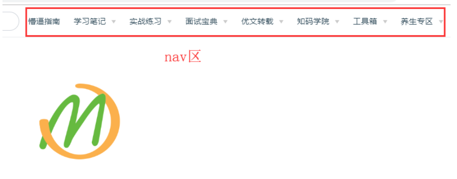
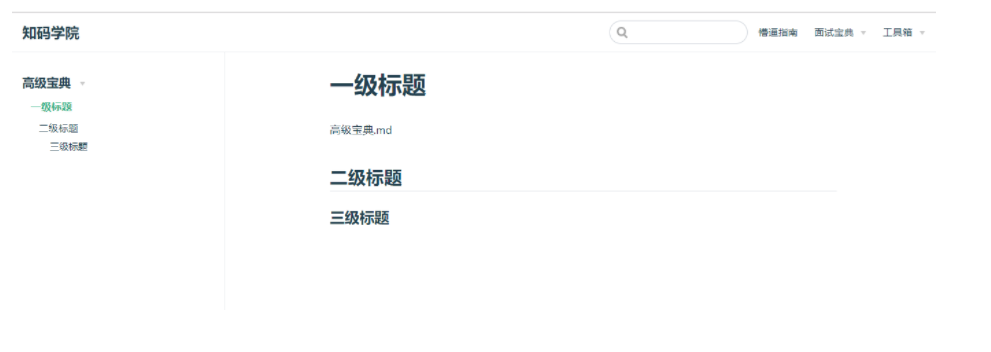

# vuePress博客搭建指南

## 第一章：初章

### 前置环境安装

+ 安装node环境和npm

###  vuePress概述

- Vue 驱动的静态网站生成器
- 基于markdown语法生成网页
- 可自定义和扩展样式
- 可以发布至github
- 详情请看官网[vuepress](https://vuepress.vuejs.org/zh/)

## 第二章：基础配置

###  安装初始化

- 全局安装

```sh
$ npm install -g vuepress

```

+ 创建个文件夹作为目录

```sh
$ mkdir vuepress-blog
# 该目录作为整本书的项目目录

```

+ 项目初始化

```sh
$ cd vuepress-blog
$ npm init -y

```

初始化后会生成一个`package.json`文件

+ 在当前目录中创建一个`docs`目录

```sh
$ mkdir docs
# 主要存放博客书籍内容

```

+ 首页内容书写(默认主题提供)

```sh
---
home: true
heroImage: /logo.jpg
actionText: 快速上手 →
actionLink: /zh/guide/
features:
- title: 简洁至上
  details: 以 Markdown 为中心的项目结构，以最少的配置帮助你专注于写作。
- title: Vue驱动
  details: 享受 Vue + webpack 的开发体验，在 Markdown 中使用 Vue 组件，同时可以使用 Vue 来开发自定义主题。
- title: 高性能
  details: VuePress 为每个页面预渲染生成静态的 HTML，同时在页面被加载的时候，将作为 SPA 运行。
footer: MIT Licensed | Copyright © 2018-present Evan You
---

```

### 核心配置

+ 在`docs`目录下创建`.vuepress`目录

```sh
$ cd docs
$ mkdir .vuepress
# 主要存放配置

```

+ 新建总配置文件`config.js`

```javascript
$ cd .vuepress
$ touch config.js
# config是整个项目的核心配置文件，所有菜单、栏目相关的配置均配置在该模块中

```

+ 在`config.js`中加入内容

```sh
module.exports = {
    title: '知码学院',
    description: '君哥带你上王者',
    dest: './dist',
    port: '7777',
    head: [
        ['link', {rel: 'icon', href: '/logo.jpg'}]
    ],
    markdown: {
        lineNumbers: true
    },
    themeConfig: {
        nav: [{
            text: '懵逼指南', link: '/guide/'
        }],
        sidebar: {'/guide/':[
            {
                  title:'新手指南',
                  collapsable: true,
                  children:[
                    '/guide/notes/one',
                  ]
                },
                {
                  title:'知码学院',
                  collapsable: true,
                  children:[
                    '/guide/notes/two',
                  ]
                }
            ]
        },
        sidebarDepth: 2,
        lastUpdated: 'Last Updated',
        searchMaxSuggestoins: 10,
        serviceWorker: {
            updatePopup: {
                message: "有新的内容.",
                buttonText: '更新'
            }
        },
        editLinks: true,
        editLinkText: '在 GitHub 上编辑此页 ！'
    }
}

```

上述配置中`themeConfig`处有2个关键配置，`nav`和`sidebar`，我们后续单独讲解

+ 运行

```sh
vuepress dev docs

```

###  导航栏配置

+ `nav`配置

`   nav`是顶部栏目导航



接下来我们在当前目录创建一个`nav.js`

+ 编辑`nav.js`

加入如下内容

```sh
module.exports = [
    {
        text: '懵逼指南', link: '/guide/'
    },
    {
        text: '面试宝典', link: '/baodian/',
		items: [
            {text: '初级开发篇', link: '/baodian/zero/'},
            {text: '中高进阶篇', link: '/baodian/high/'},
        ]
    },
    {
        text: '工具箱',
        items: [
			{
                text: '在线编辑',
				items: [
					{text: '图片压缩', link: 'https://tinypng.com/'}
				]
            },
			{
                text: '在线服务',
				items: [
					{text: '阿里云', link: 'https://www.aliyun.com/'},
					{text: '腾讯云', link: 'https://cloud.tencent.com/'}
				]
            },
			{
                text: '博客指南',
				items: [
					{text: '掘金', link: 'https://juejin.im/'},
					{text: 'CSDN', link: 'https://blog.csdn.net/'}
				]
            }
        ]
    }
]

```


+ nav配置注意点
  + `nav`可以支持本地目录和链接
  + `nav`由text、link、items组成
    + text：栏目名（项名）
    + 链接，可以指向本地目录和http地址
    + items：可以包含多个text和link，可以继续反复套用组成复杂的菜单
  + `nav`配置时需要与本地的目录对应
    + 如上述我配置了懵逼指南和面试宝典栏目
    + 懵逼指南：对应的事`/guide/`，则我需要再`docs`目录下创建一个`guide`目录
    + 面试宝典：对应的是`/baodian/`，则我需要在`docs`目录下创建一个`baodian`目录
    + `baodian`子目录：上述配置中`baodian`下有2个子目录，则我需要在下面新建2个子目录与之对应

+ 对应目录截图


### 侧边栏配置

+ sidebar

`sidebar`是左侧标题导航，可以指定配置也可以设置为`auto`

```sh
sidebar: 'auto'

```


+ `sidebar`配置语法

```sh
module.exports = {
	'/guide/': require('../guide/sidebar'),

	'/baodian/zero': require('../baodian/zero/sidebar'),
	'/baodian/high': require('../baodian/high/sidebar'),
}	

```

+  ` /guide/`：该key是与上述的`nav`中link对应，在请求`nav`时会自动切换当前的侧边目录，所以需要该配置
+ `/baodian/zero`同理
+ 后续的`require`表示引入一个指定目录的`sidebar.js`文件，其本身可以直接写在这里，但为了方便维护我们需要将每个模块的侧边栏js抽取出来，单独存放在内容模块的目录下

+   sidebar.js 

这里我贴出目录：`/docs/guide/sidebar.js`文件内容

```sh
module.exports = [
		{
		  title:'新手指南',
		  collapsable: true,
		  children:[
			'/guide/notes/one',
		  ]
		},
		{
		  title:'知码学院',
		  collapsable: true,
		  children:[
			'/guide/notes/two',
		  ]
		}
	]

```

参数解析

+ `title`：表示侧边栏大标题
+ `collapsable`：是否可收缩
+ `children`：具体的`.md`文件，这里无需指定后缀

预览效果如下



### 静态资源配置

静态资源是最重要的一部分，比如图片，比如`js`，比如`css`

vuepress程序默认的图片目录是`/docs/.vuepress/public`

```sh
$ cd .vuepress
$ mkdir public

```

+ 图片

比如我们要指定首页显示图片，那么需要将首页内容中的图片路径更改成如下

```sh
# /docs/.vuepress/public目录下有一张 logo.jpg的图片
heroImage: /logo.jpg

```

即`/logo.jpg`就是指`/docs/.vuepress/public/logo.jpg`

+ css

css与图片路径一样，比如js中要加载我们指定的css文件，那么可以像如下这样

- 在public目录下新建一个css目录

```sh
$ cd public
$ mkdir css
$ touch style.css

```

编辑css内容，加入如下css做测试（你也可以自定义其他内容）

```css
a{color:#333;text-decoration:none; }

```

+ 修改`.vuepress`下的`config.js`

```js
# 修改head属性如下
head: [
        ['link', {rel: 'icon', href: '/logo.jpg'}],
        ["link", { rel: "stylesheet", href: "/css/style.css" }]
    ],

```

+ 重启预览效果

+ js

如果我们要自定义一些js动态效果，我们可以也可以像css操作那样

- 在public目录下新建一个`js`目录

```sh
$ cd public
$ mkdir js
$ touch main.js

```

在js中加入一些测试内容

```js
function init(){
    console.log("hello");
}
//因为界面加载原因，我们延迟500ms再调用init
setTimeout("init()",500)

```

修改`.vuepress`下的`config.js`

```js
# 修改head属性如下
head: [
        ['link', {rel: 'icon', href: '/logo.jpg'}],
        ["link", { rel: "stylesheet", href: "/css/style.css" }],
        ["script", { charset: "utf-8", src: "/js/main.js" }],//新加入
    ],

```

+ 重启预览效果

