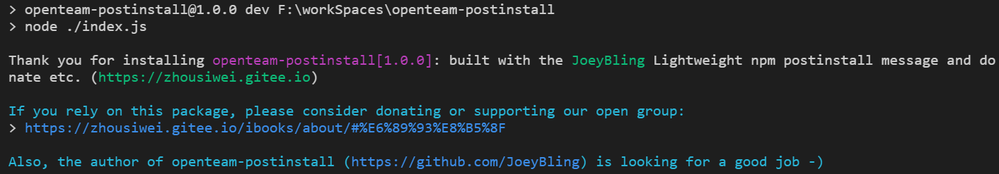

# Open Team postinstall

[](https://www.npmjs.com/package/openteam-postinstall)

[](https://www.npmjs.com/package/openteam-postinstall)
[](https://www.npmjs.com/package/openteam-postinstall)
[](https://www.npmjs.com/package/openteam-postinstall)


[](https://zhousiwei.gitee.io "Author")
[](https://jq.qq.com/?_wv=1027&k=58Ypj9z "博客搭建交流群")

------------------

> **欢迎使用和Star支持，如使用过程中碰到问题，可以提出 [Issues](https://github.com/JoeyBling/openteam-postinstall/issues)，我会尽力完善**

## 介绍
&#160;&#160;&#160;&#160;**在`npm install`后提示用户消息或捐赠. Prompt user message or donate after `npm install`.**

> 此插件根据开源插件**[opencollective-postinstall](https://github.com/opencollective/opencollective-postinstall)**更改调整，加入了一些自定义参数配置.

- 功能还很少，欢迎各位给我提意见和建议~

## 效果截图



## 安装

```bash
npm install openteam-postinstall --save
# or
yarn add openteam-postinstall
```

------------

## 开始使用

### 引入该插件

> 在`package.json`中添加：

```json
{
  "scripts": {
    "postinstall": "node -e \"try{require('openteam-postinstall')}catch(e){}\" || exit 0"
  }
}
```

### 插件配置

```javascript
// 默认配置
"openteam": {
  // 开启调试模式(default: false)
  "debug": false,
  // GitHub地址
  "github": "https://github.com/JoeyBling",
  // 打赏配置
  "donate": {
    // 是否启用(default: true)
    "enable": true,
    // 打赏链接
    "url": "https://zhousiwei.gitee.io/ibooks/about/#%E6%89%93%E8%B5%8F"
  },
  // 其他自定义配置
  "others": {
    // 自定义Banner输出（可以使用${param.*}动态变量进行输出，取值为当前`packages.json`文件配置）(关闭请设置为false或置空)
    "banner": "\n\u001B[96mAlso, the author of ${name} (\u001B[94m${openteam.github}\u001B[96m) is looking for a good job -)\u001B[0m\n"
  }
}
```

## Disabling this message

In some places (e.g. CI) you may want to disable this output. You can do this by setting the environment variable `DISABLE_OPENCOLLECTIVE=true`.

It will not be shown if npm's log level is set to silent (`--silent`), warn (`--quiet`), or error (`--loglevel error`).

## 其他项目支持

- ### 一款简洁优雅的hexo主题：[hexo-theme-yilia-plus](https://github.com/JoeyBling/hexo-theme-yilia-plus)
- ### 一款简洁优雅的VuePress主题：[vuepress-theme-yilia-plus](https://github.com/JoeyBling/vuepress-theme-yilia-plus)
- ### VuePress集成Live2D看板娘：[vuepress-plugin-helper-live2d](https://github.com/JoeyBling/vuepress-plugin-helper-live2d)

## 捐赠
&#160;&#160;&#160;&#160;**如果感觉对您有帮助，请作者喝杯咖啡吧，请注明您的名字或者昵称，方便作者感谢o(*￣︶￣*)o**

| 微信 | 支付宝 |
| :---: | :---: |
|  |  |

## 关于我
- [个人博客](https://zhousiwei.gitee.io/)
- [技术笔记](https://zhousiwei.gitee.io/ibooks/)
- [GitHub](https://github.com/JoeyBling)
- [码云](https://gitee.com/zhousiwei)
- [简书](https://www.jianshu.com/u/02cbf31a043a)
- [CSDN](https://blog.csdn.net/qq_30930805)
- [知乎](https://www.zhihu.com/people/joeybling)
- [微博](http://weibo.com/jayinfo)
- **主要涉及技术：`Java后端开发`、`聚合支付`、`公众号开发`、`开源爱好者`、`Linux`**

## LICENSE

[](./LICENSE "LICENSE")