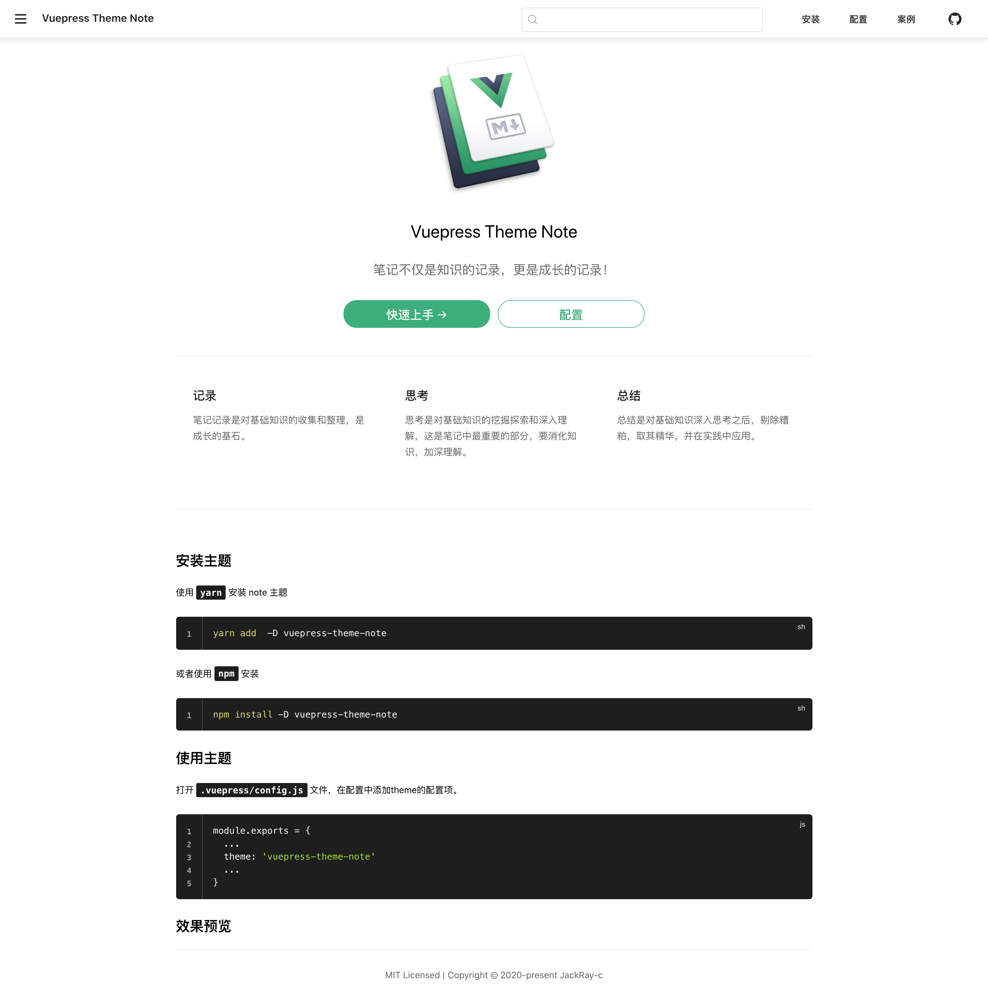

# vuepress-theme-note
A Vuepress Theme For Note.

## 安装主题

使用 `yarn` 安装 note 主题

```bash
yarn add  -D vuepress-theme-note
```

或者使用  `npm` 安装

```bash
npm install -D vuepress-theme-note
```

## 使用主题

打开 `.vuepress/config.js` 文件，在配置中添加theme的配置项。

```javascript
module.exports = {
  ...
  theme: 'vuepress-theme-note'
  ...
}
```

## 效果预览

